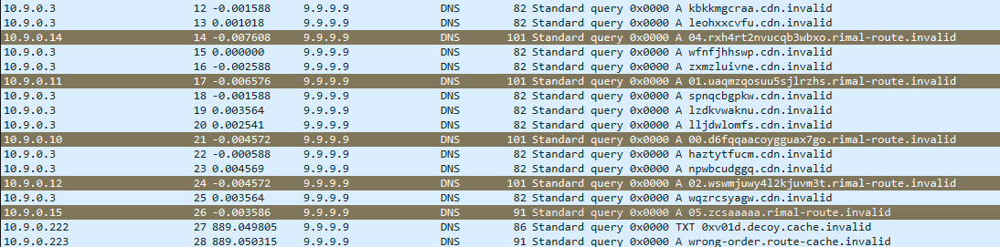

# Rimal DNS Caravan

## Description

A short capture from a kiosk resolver contains a route update that never appears as a normal file.

## Solution Walkthrough

You can see these packets from 00 to 05:


After sorting them, they look like this:

```text
00 d6fqqaacoygguax7go
01 uaqmzqosuu5sjlrzhs
02 wswmjuwy4l2kjuvm3t
03 bjrex4ssenf7fc6lkj
04 rxh4rt2nvucqb3wbxo
05 zcsaaaaa
```

Concatenating the second column gives:

```text
d6fqqaacoygguax7gouaqmzqosuu5sjlrzhswswmjuwy4l2kjuvm3tbjrex4ssenf7fc6lkjrxh4rt2nvucqb3wbxozcsaaaaa
```

This string only uses lowercase letters and the numbers 2-7, which strongly resembles Base32. After converting it to uppercase and performing a Base32 decode, you can see that the header starts with `1f 8b 08`. These are the magic bytes for gzip. Decompressing it will reveal the flag.

## Flag

```text
0xV01D{dns_frames_rebuilt_the_route_home}
```
