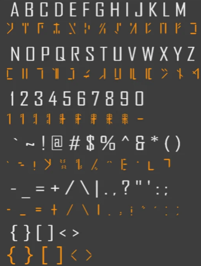

# Scratching Around

## Description

I found this cipher scratched onto the ground. Maybe it means something. Maybe knowing what the author is would be helpful.

## Solution Walkthrough

1. **Step 1**：

    

    https://www.matthewherber.com/avali-scratch-trainer/

    I used this image together with the website above to compare against the image provided by the challenge, which directly gave me the flag.

## Flag

```text
dalctf{av@1i_scra7ching_ar0und}
```
