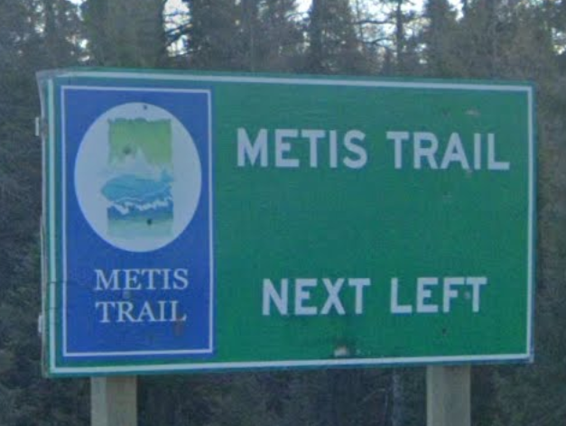

# Trails for Life Writeup

## 題目描述
```text
I would get lost even on a strait trail
```
https://geosint.dalctf2026.com/

## 解題思路

1. **第一步**：

    我用Google以圖搜圖：

    

    找到了：

    https://www.shutterstock.com/image-photo/may-30-2024-metis-trail-road-2770283391

    發現是加拿大的516號公路。

    但在516號公路上沒有發現這個路標，後來才發現是"轉進"516號公路的路標。

    最後在510號與516號公路的路口附近發現這個路標。

## Google Map Location

https://maps.app.goo.gl/GkPEM35t3XMsHDrt8
    
## Flag

```text
dalctf{l4br4d0r_tr41l5}
```