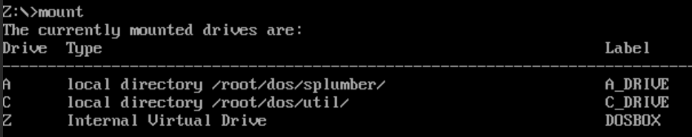
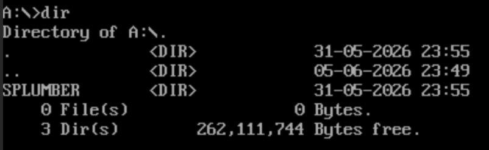
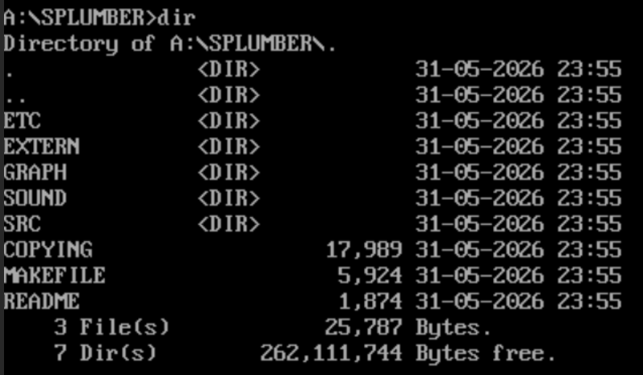
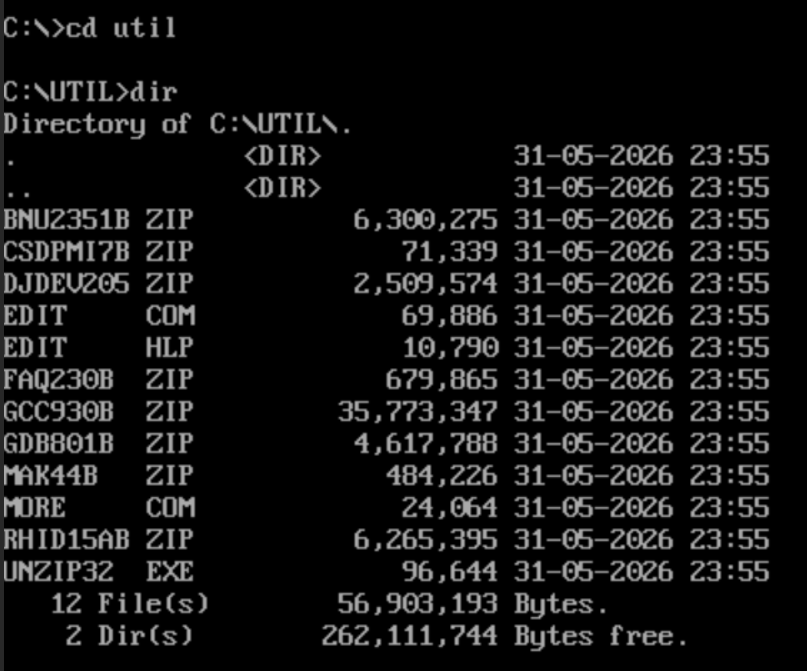
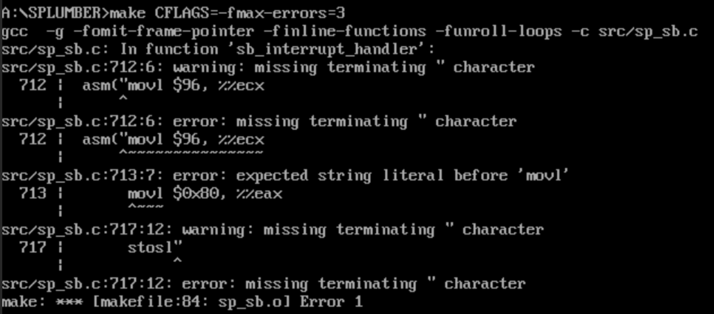
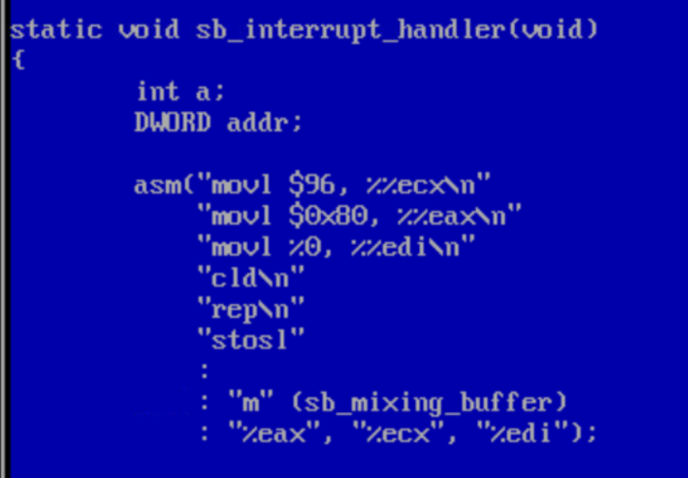
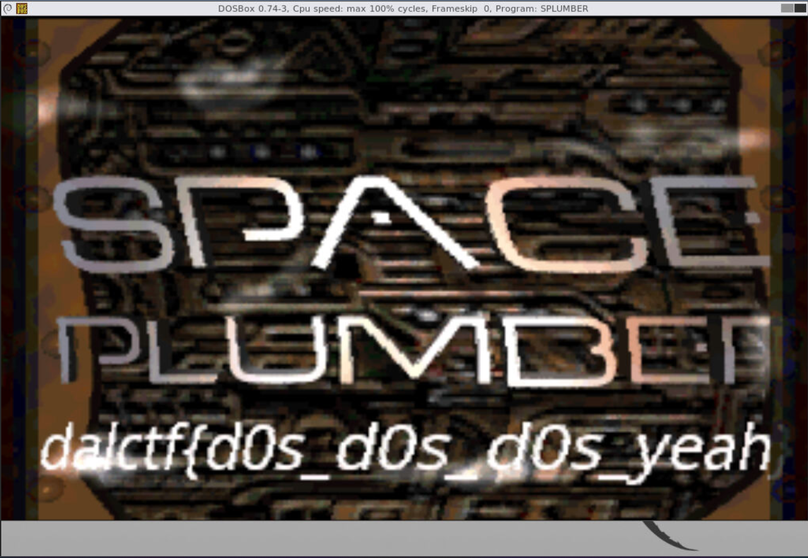

# MS DOS Plumber Writeup

## 題目描述

My friend gave me a floppy with her modded version of Angel Ortega's game Space Plumber (1997), but she said there was something wrong with one of the files. Can you help me fix, build, and run it?

## 解題思路

因為我當初也沒有想到會做出來這題，所以沒有每個步驟都截圖，抱歉。

1. **第一步**：

    題目給了一台noVNC的DosBox虛擬機，初始磁碟在z槽。

    先mount看看有哪些磁碟：

    

    發現裡面有A、C、Z槽。

    Z:裡面沒有東西，只是一個虛擬系統碟。

    所以我跳到A:

    ```bash
    a:
    dir
    cd splumber
    dir
    ```

    

    

    因為裡面有makefile，所以我嘗試直接在\splumber裡面直接make，結果跳出：

    ```text
    'make' is a illegal command
    ```

2. **第二步**：

    A:裡面看起來沒有可以拿來build的工具，所以我到C:裡面看看，然後我在util裡面發現一些compiler：

    

    因為是zip檔，所以我先把他們全部解壓：

    ```bash
    mkdir \djgpp
    unzip32 djdev205.zip -d c:\djgpp
    unzip32 bnu2351b.zip -d c:\djgpp
    unzip32 gcc930b.zip -d c:\djgpp
    unzip32 mak44b.zip -d c:\djgpp
    unzip32 csdpmi7b.zip -d c:\djgpp
    ```

    解壓之後建置環境：

    ```bash
    set DJGPP=c:\djgpp\djgpp.env
    set PATH=c:\djgpp\bin;c:\util;%PATH%
    ```

    這樣應該就能make了。

3. **第三步**：

    ```bash
    a:
    cd \splumber
    make
    ```

    之後跳了很多error，noVNC又不給我上下移動terminal，所以我先從前面的開始看：

    

    發現是src/sp_sb.c壞掉了。

    在terminal輸入：

    ```bash
    edit src\sp_sb.c
    ```

    就會進入修改器，在上方點Search，輸入：

    ```text
    movl $96
    ```

    會看到一大串c，錯誤原因是c語言不能直接在字串中換行，所以要補成字串，改成：

    ```c
    asm("movl $96, %%ecx\n"
        "movl $0x80, %%eax\n"
        "movl %0, %%edi\n"
        "cld\n"
        "rep\n"
        "stosl"
        :
        : "m" (sb_mixing_buffer)
        : "%eax", "%ecx", "%edi");
    ```

    

    就可以了。

    然後按左上角的File，Save之後Exit，回到terminal。

4. **第四步**：

    修好之後回A:，make之後就會開始build。

    完成build之後，再dir一次就會看到splumber.exe。

    輸入splumber，讓他執行之後，就會跳出遊戲畫面並拿到flag。

    Commands:

    ```bash
    a:            # You should be in A:\splumber
    make
    dir
    splumber
    ```

    

## Flag

```text
dalctf{d0s_d0s_d0s_yeah}
```
