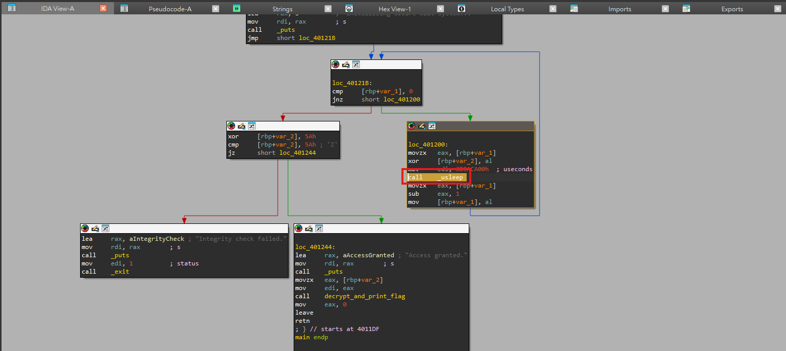
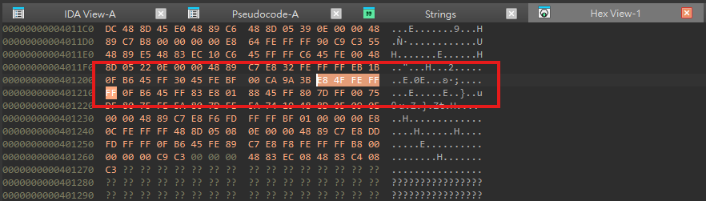

# Bandaids Help me Heal

## Description

This progam is supposed to print the flag for me but for some reason it's got a security system attached to it

## Solution Walkthrough

Opening it in IDA, you can see the `main` function. There is a `while` loop at the beginning, and each iteration waits for 1,000,000,000 microseconds, which is 1,000 seconds.

At first glance, this loop appears to be infinite. However, since `char` is one byte and the assembly performs a decrement on a single byte, it will decrement from `0xff` all the way down to `0x01`. The next iteration becomes `0x00` and breaks out of the loop. Therefore, this loop runs a total of 255 times.

As for `v4`, it gets XORed with `v5` in every iteration. Overall, it XORs everything from 1 to 255, resulting in 0. The result of XORing 0 with `0x5A` is `0x5A`. Thus, as long as it runs long enough, the loop will finish and you will get the flag.

```c
int __fastcall main(int argc, const char **argv, const char **envp)
{
  unsigned __int8 v4; // [rsp+Eh] [rbp-2h]
  char v5; // [rsp+Fh] [rbp-1h]

  v5 = -1;
  v4 = 0;
  puts("Initializing secure wait system...");
  while ( v5 )
  {
    v4 ^= v5;
    usleep(1000000000u);
    --v5;
  }
  if ( (v4 ^ 0x5A) != 0x5A )
  {
    puts("Integrity check failed.");
    exit(1);
  }
  puts("Access granted.");
  decrypt_and_print_flag(90, argv);
  return 0;
}
```

Regarding the flag decryption logic, `v2` and the contiguous stack memory following `v2` are used as the encrypted flag buffer. The program first writes several constants, where `*(_QWORD *)((char *)v3 + 6)` overwrites 8 bytes starting from offset 6 of `v3`. Finally, the program XORs the entire 22 bytes starting from `&v2` with `a1` (which is XOR 0x5A) to get the flag.

```c
int __fastcall decrypt_and_print_flag(char a1)
{
  __int64 v2; // [rsp+10h] [rbp-20h] BYREF
  _QWORD v3[2]; // [rsp+18h] [rbp-18h]
  int v4; // [rsp+28h] [rbp-8h]
  int i; // [rsp+2Ch] [rbp-4h]

  v2 = 0x38213C2E39363B3ELL;
  v3[0] = 0x3B2A0523283B3433LL;
  *(_QWORD *)((char *)v3 + 6) = 0x273E3F32392E3B2ALL;
  v4 = 22;
  for ( i = 0; i < v4; ++i )
    *((_BYTE *)&v3[-1] + i) ^= a1;
  return printf("Flag: %s\n", (const char *)&v2);
}
```

Based on the above, there are two solutions.

### Solution 1

Write a script to decrypt the flag according to the logic of `decrypt_and_print_flag`. You can refer to solution.py.

### Solution 2

Alternatively, you can patch out `usleep()`. First, find `call _usleep` in IDA's IDA View-A.



Then switch to Hex View-1.



Change these five bytes to NOP `90 90 90 90 90`. Once done, executing it will also yield the flag (`chall_patched` is the modified file).

```text
┌──(kali㉿kali)-[~/Desktop]
└─$ ./chall_patched          
Initializing secure wait system...
Access granted.
Flag: dalctf{binary_patched}
```

## Flag

```text
dalctf{binary_patched}
```
