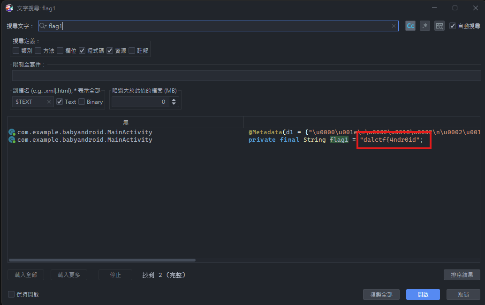
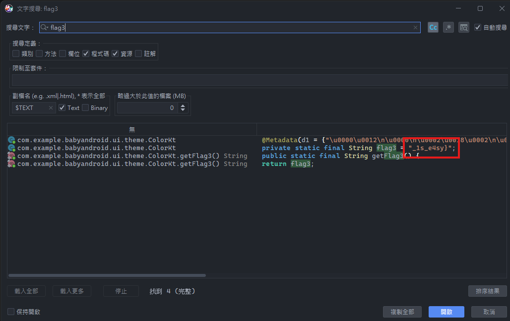
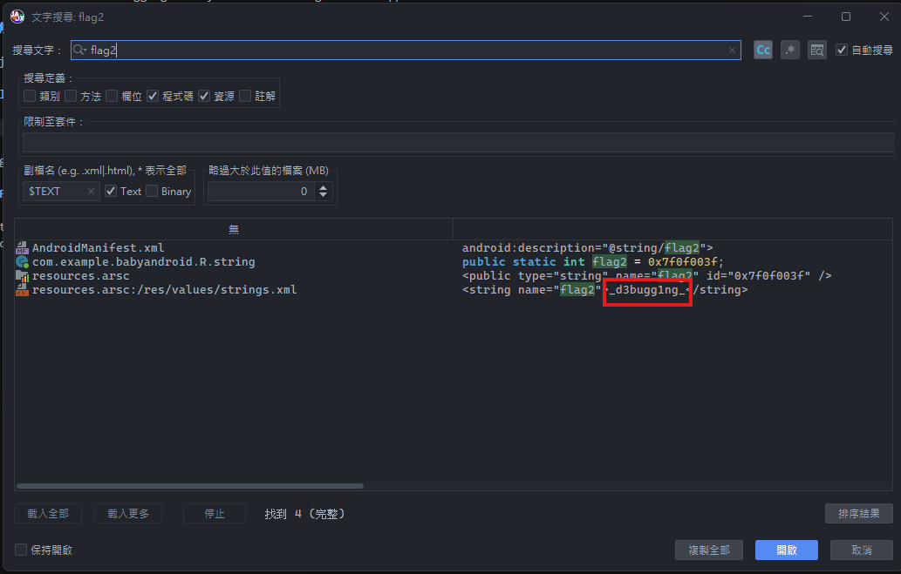

# Baby Android

## 題目描述

Welcome to Android Debugging. Can you find the flag in this application?

## 解題思路

用 jadx 打開以後可以看到第一段 flag `dalctf{4ndr0id` 以及第三段 flag `_1s_e4sy}`。





flag2 則是在 resource.arsc 的 strings.xml 裡面



## Flag

```text
dalctf{4ndr0id_d3bugg1ng_1s_e4sy}
```
