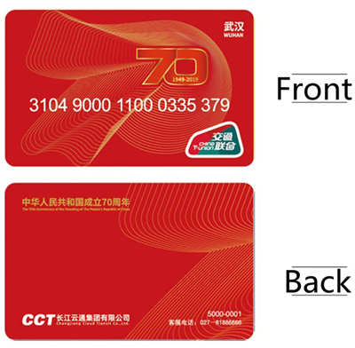

# Card Numbers

## 題目描述

I went to China a while back and while I was there I got offered a credit card. I don't know if it's a scam so I should check to see if my credit card number is valid.

## 解題思路

我先在網路查 China T-Union 的信用卡，找到如圖的卡號



接著輸進去，發現他說這不是一張有效的卡，查了一下原來是 checksum 錯了，原本的 `3104900011000335379` 總和為 52，不是十的倍數所以會無效

把最後一位改成 7 即可 (加起來是 50，是十的倍數)

## Flag

```text
dalctf{H4v1ng_fun_w1th_cr3d1t_c4rds}
```
