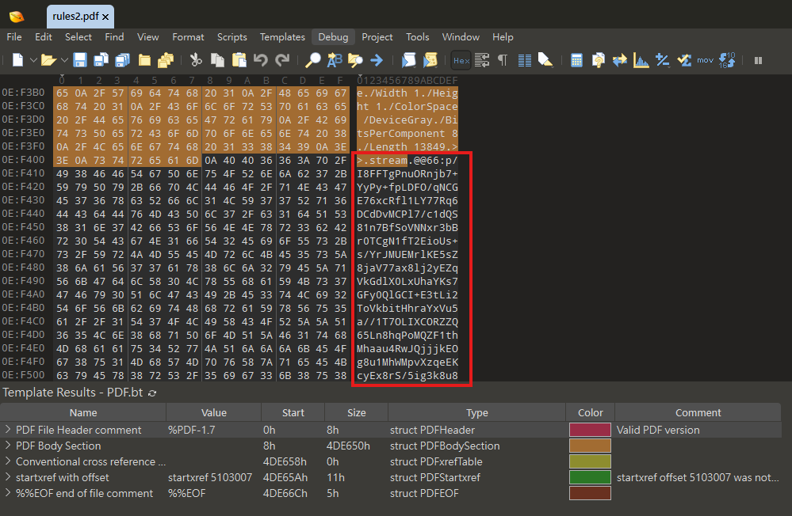

# Warmerer Up

## 題目描述

What, what, the rules again again?

## 解題思路

打開 rules2.pdf 以後可以看到最底部有 teapot_2026，我一開始是覺得可能是 steghide 之類的或是隱藏 zip 的密碼

於是打開 010 Hex Editor，發現有疑似 base64 的字串，而且好像都是以 `@@編號:<資料>@@` 來分隔的



我第一個猜這應該就是 zip 了，於是寫了個腳本將資料提取出來並存成 hidden.zip，完了以後拿 teapot_2026 當密碼就可以拿到 image.sif

用 file 查看以後可以發現這其實是一個映像檔 `image.sif: a run-singularity script executable (binary data)`，我先 grep 看看 flag.txt，結果發現是放在 `/home/flag/flag.txt` 裡面

好了以後用 `apptainer exec --containall --no-home image.sif cat /home/flag/flag.txt` 就可以得到 flag 了

## Flag

```text
dalctf{n0w_y0u_r3ally_b3tt3r_kn0w_th3_rul3s}
```
