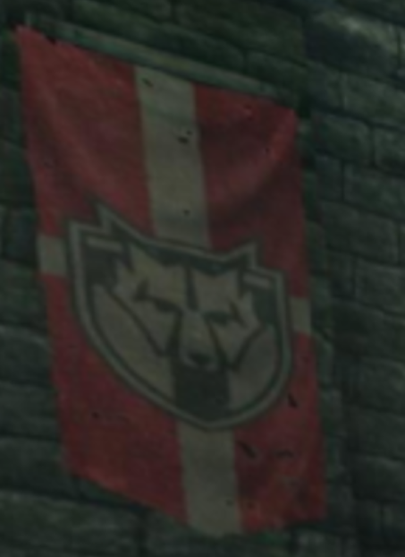

# Hey, you.

## 題目描述

Hey, you. You're finally awake. You were trying to cross the border, right? Walked right into that Imperial ambush, same as us, and that thief over there. Damn you Stormcloaks. Skyrim was fine until you came along. Empire was nice and lazy. If they hadn't been looking for you, I could've stolen that horse and be halfway to Hammerfell. You there. You and me - we shouldn't be here. It's these Stormcloaks the Empire wants. We're all brothers and sisters in binds now, thief. Shut up back there! And what's wrong with him, huh? Watch your tongue. You're speaking to Ulfric Stormcloak, the true High King. Ulfric? The Jarl of Windhelm? You're the leader of the rebellion. But if they've captured you... Oh gods, where are they taking us? I don't know where we're going, but Sovngarde awaits. No, this can't be happening. This isn't happening. Hey, what village are you from, horse thief? Why do you care? A Nord's last thoughts should be of home. Where was this photo taken and on what website? Flag format: dalctf{city_domainName}

## 解題思路

看到圖片左上角有一個旗幟，以圖搜圖就可以發現他是《艾爾登法環：黃金樹幽影》裡面獨孤城的堡壘 (我沒玩所以我不確定)


網站的部分我是在 google 上面查 `geoguessr elden ring`，第一個結果就是 lostgamer.io，而且介面和題目中的一模一樣

## Flag

```text
dalctf{solitude_lostgamer.io}
```
