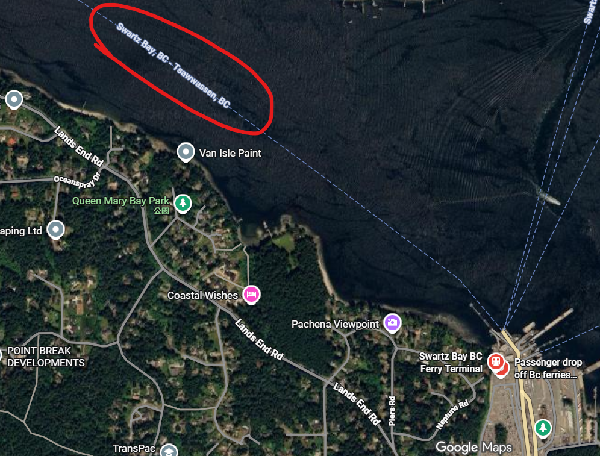
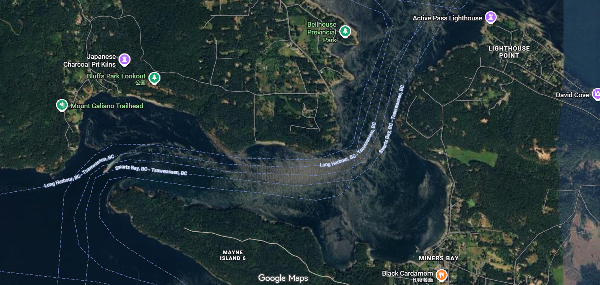
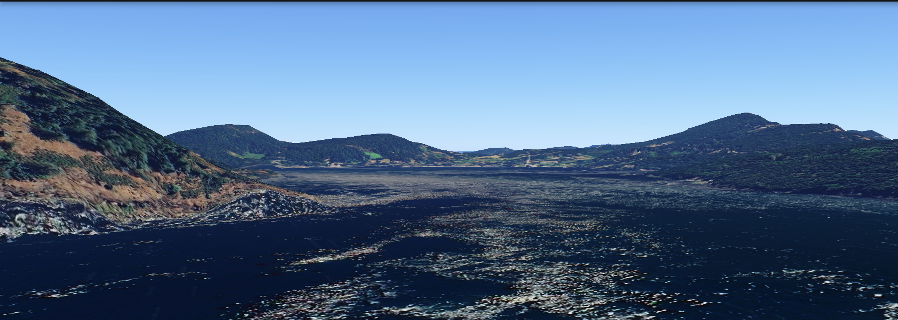
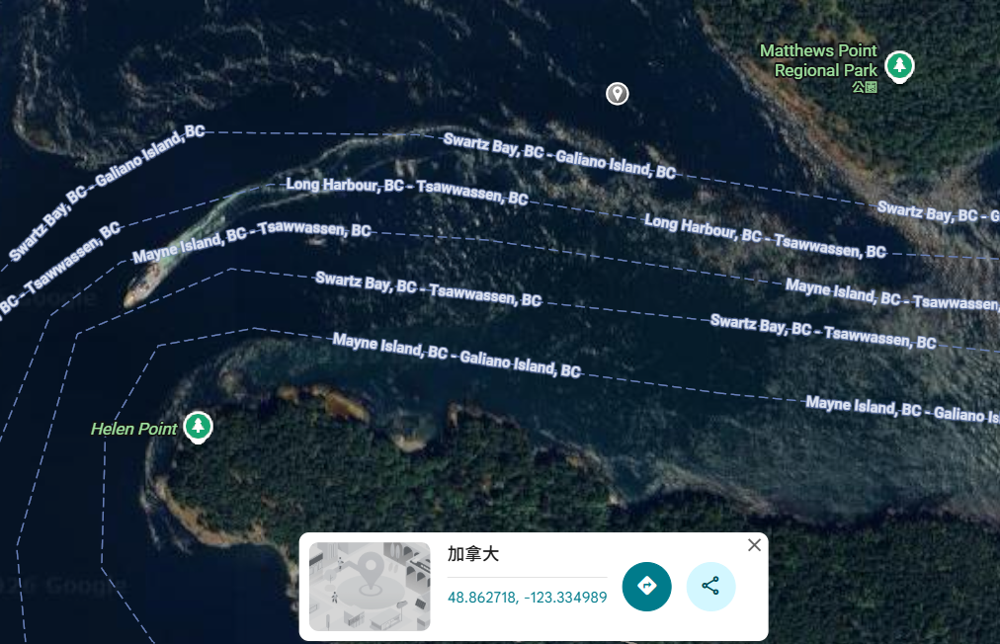

# Ship's Whistle

## Description

What coordinates was this photo taken at? Flag format is dalctf{\d+.\d{2}_\d+.\d{2}} (i.e., decimal coordinates to 2 decimal places. if the answer is negative coordinates then you need to include the negative '-' symbol).

## Solution Walkthrough

1. **Step 1**：

    There is an obvious BCFerries logo on the side of the ship, so I found the website of this ferry company.

    https://www.bcferries.com/on-the-ferry/our-fleet

    This webpage contains images of the company’s ships, so I found that the ship in the challenge should be this one:

    https://www.bcferries.com/on-the-ferry/our-fleet/spirit-of-british-columbia/SOBC

    There is a YouTube video below. After watching it briefly, I found that the image given in the challenge happens to be at around 0:12 in the video, and it also provides more complete geographic information.

    https://www.youtube.com/watch?v=6u9SvhbYVko

2. **Step 2**：

    I first opened Google Maps and found this ferry route:

    

    Then I followed this route to find the most likely shooting location and used Google Earth to confirm the terrain:

    

    

    Luckily, the satellite imagery captured traces of the ship. By marking a point near the ship, we can get the flag.

    

## Flag

```text
dalctf{48.86_-123.33}
```
