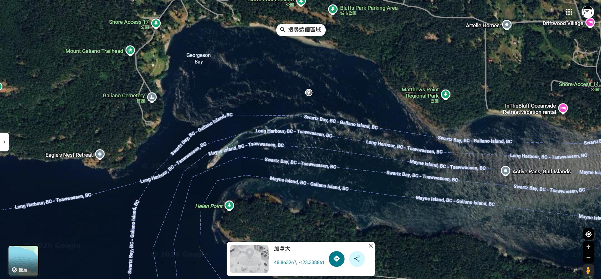

# Ship's Whistle

## 題目描述

What coordinates was this photo taken at? Flag format is dalctf{\d+.\d{2}_\d+.\d{2}} (i.e., decimal coordinates to 2 decimal places. if the answer is negative coordinates then you need to include the negative '-' symbol).

## 解題思路

船上面都寫了 bc ferries spirit of british columbia，所以基本上大概就可以知道他的航線

btw 後來發現 boat.png 是在[這部影片](https://www.youtube.com/watch?v=6u9SvhbYVko)裡面 0:12 截圖的

在這附近，我把 -123.31 ~ -123.34 都試了一遍，最後發現是 -123.33



## Flag

```text
dalctf{48.86_-123.33}
```
