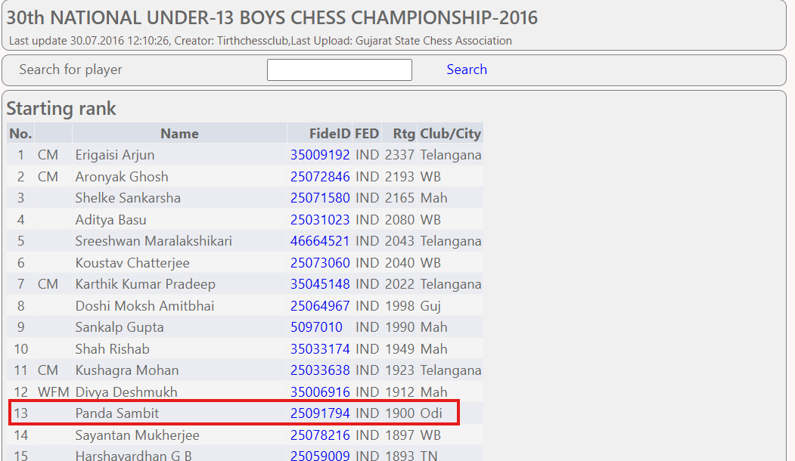
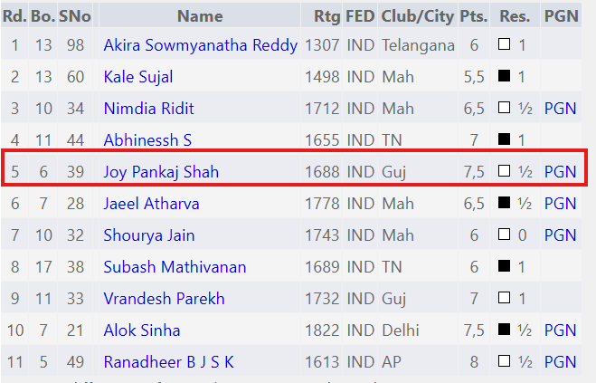

# The Joy of Draw

## 題目描述

My best friend Joy Shah is an incredible chess player. We always used to look back at one specific match from July 2016 where he managed to force a brilliant draw. At the time, I never understood why he was so proud of a tie instead of a victory. Especially considering his opponent was highly rated at 1900! As time goes on, my memories of that tournament are beginning to decay. I know it took place at the 30th National Under-13 Boys Chess Championship in Ahmedabad, but the fine details are slipping away.

Find the following information about that match:

- Tournament Round (Format: digits only)
- Name of the Opponent (Format: First_Last)
- Last Traded Piece (Format: Capitalized singular noun)
- Name of the Opening Defence (Format: Capitalized_Words)
Flag Format: dalctf{Round_First_Last_Piece_Opening_Defence}

## 解題思路

去 chess-results 查 [30th National Under-13 Boys Chess Championship](https://chess-results.com/Test/tnr228504.aspx?lan=1)，進去以後因為題目說對手的 rating 是 1900，查了一下發現是 Panda Sambit 這個人



點它的名字 (要先點 show tournament details) 可以看到比賽紀錄，其中 round 5 就是 Joy Shah



看棋譜判斷可以知道最後被吃掉的棋子是 rook，並且是 king's indian defence

## Flag

```text
dalctf{5_Sambit_Panda_Rook_Kings_Indian_Defence}
```
