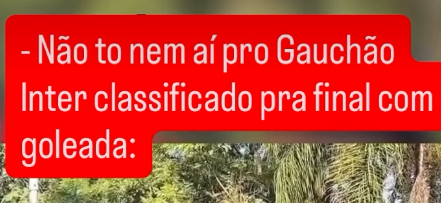

# War Chants

## Description

My friend Carlos sent me this "war chant" audio, but I swear there was supposed to be a video with it. Can you help me find where was it recorded? The flag will be the name of the location where it was recorded separated by underscores in the format DalCTF{place_of_recording} (for example, DalCTF{wanderer_grounds} if it was recorded in the Wanderer Grounds stadium in halifax)

## Solution Walkthrough

After getting the audio file, since I don't understand Portuguese, I used a tool to extract the lyrics (something like `vamo que vamo meu inter`). Next, I searched on Google, as the challenge mentioned it was from a video.


Then I found [an Instagram video](https://www.instagram.com/reels/DVEFLE1kbSN/), where a line of text can be seen at the top of the video.



After doing a reverse image search, I found [a video filmed at a similar location](https://www.tiktok.com/@gauchaesportes/video/7614961056774884628), which also provided more information. This allows us to infer that the topic of the video is an interview with Inter fans before the 2026 Gauchão final Gre-Nal.

So, it can be clearly inferred that this should be near their home stadium (I tried using the home stadium as the flag, but it was wrong). I searched for `Beira-Rio nearby park` and found [a website](https://www.google.com/search?q=https%3A%2F%2Fwww.tripadvisor.com%2FAttractionsNear-g303546-d2365562-Estadio_Beira_Rio-Porto_Alegre_State_of_Rio_Grande_do_Sul.html) introducing nearby attractions, and `parque marinha do brasil` was among them.

## Flag

```text
DalCTF{parque_marinha_do_brasil}
```
