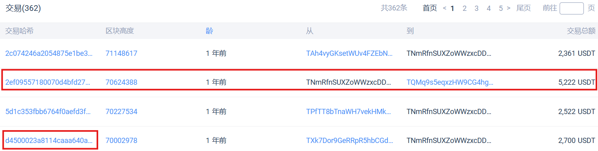
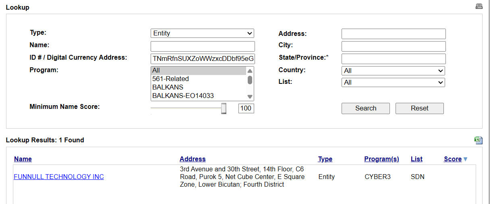

# Follow The Layer

## 題目描述

Our fraud response team flagged a suspicious USDT transfer linked to an online scam operation.

The payment trail starts here:

```text
d4500023a8114caaa640ab92bb8f73830a5303ccdfc4e9b0cf862bdae7ae336b
```

The money didn't just vanish — it was layered through a series of wallets before disappearing into the shadows. But every hop leaves a trace.

Trace the laundering chain, find where the money stops being attributable, and answer:

What is the **transaction hash** of the last traceable hop?
What **date** did it occur? *(MM/DD/YYYY)*
What is the **name** of the sanctioned entity at the heart of this operation? **Flag format**: `LYKNCTF{tx_hash:MM/DD/YYYY:ENTITY}` **Examble** :`LYKNCTF{a1b2c3...f64:01/15/2025:BINANCE}`

## 解題思路

去[這個網站](https://usdt.tokenview.io/cn/tx/d4500023a8114caaa640ab92bb8f73830a5303ccdfc4e9b0cf862bdae7ae336b) 可以看到這筆交易是從 `TXk7Dor9GeRRpR5hbCGd4rBieM21v4BcwX` 轉帳 2700 USDT 到 `TNmRfnSUXZoWWzxcDDbf95eGQYXt1mJDt8`

[點進去](https://usdt.tokenview.io/cn/address/TNmRfnSUXZoWWzxcDDbf95eGQYXt1mJDt8)以後可以發現他在之後轉了 5222 USDT 到 `TR7NHqjeKQxGTCi8q8ZY4pL8otSzgjLj6t`



接著繼續查可以看到 `TR7NHqjeKQxGTCi8q8ZY4pL8otSzgjLj6t` 又把 5222 USDT 轉給 `TJ7hhYhVhaxNx6BPyq7yFpqZrQULL3JSdb`，這個是交易所的地址，因為交易非常頻繁，根據題目 transaction hash 即為 `7e401f8004084d4bf9f792535fdf5b89138a935d027b6b75ceb2dd3ac8838fab`，date 為 `03/21/2025`

至於 sanctioned entity 則要去[這個網站](https://sanctionssearch.ofac.treas.gov)查詢，可以發現是 `FUNNULL`



## Flag

```text
LYKNCTF{7e401f8004084d4bf9f792535fdf5b89138a935d027b6b75ceb2dd3ac8838fab:03/21/2025:FUNNULL}
```
