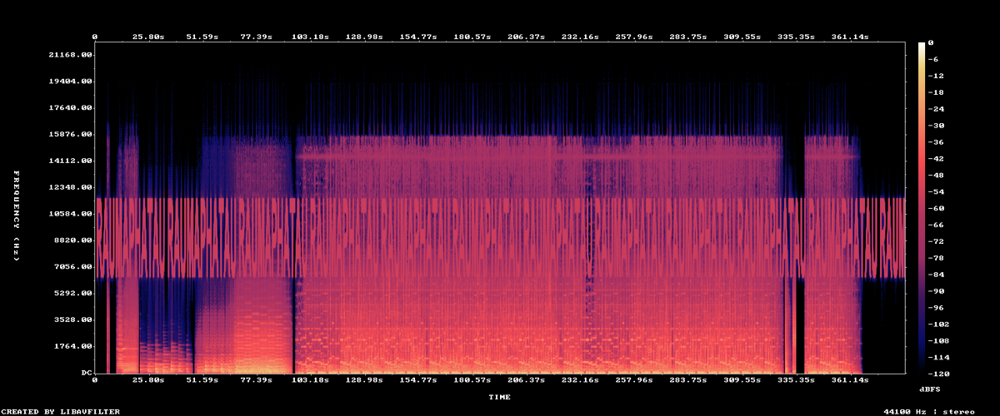

# Thanh Hoa 1

## Description

36 Thanh Hoa

## Solution Walkthrough

At the end of the video, there is a hidden zip file. You can open it using the password `RAUMAPHATAU` to get the flag.

The password is hidden in the audio; you can see it using a spectrogram analysis tool.



## Flag

```text
LYKNCTF{NGU01_TH4NH_H04_4N_R4U_M4_PH4_DU0NG_T4U}
```
