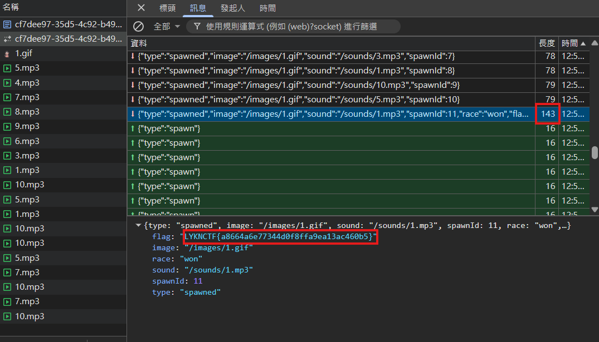

# Waguri1

## 題目描述

The SPAWN button looks harmless, but there's something behind it. Can you find it out?

## 解題思路

可以看到進去以後會開 websocket 跟後端溝通，因為不知道怎麼得到 flag，於是我就用連點器點 spawn，接著就看到一個長度比較長的 data，裡面就是 flag



## Flag

```text
LYKNCTF{a8664a6e77344d0f8ffa9ea13ac460b5} (dynamic flag)
```
