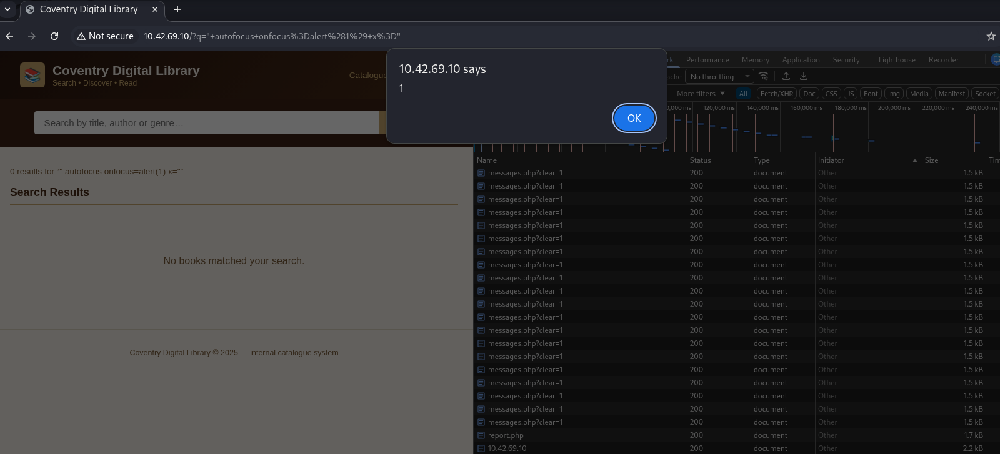
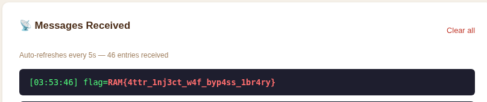

這題看起來就是 admin bot 的題目，可以來 xss 或是 ssrf
一開始我是往 ssrf 的方向搜尋，找了很久以後發現沒什麼東西。
後來往 xss 找，發現他雖然會 html escape 但是只會 escape <> 的樣子

於是使用 " autofocus onfocus=alert(1) x=" 結果成功了
好了接下來就在想 admin 是怎麼把 flag 送到 messages，一開始以為是 ?msg=
但好像沒屁用，後來用 " autofocus onfocus="navigator.sendBeacon('/messages.php',document.cookie)" x="
即可取得 flag
