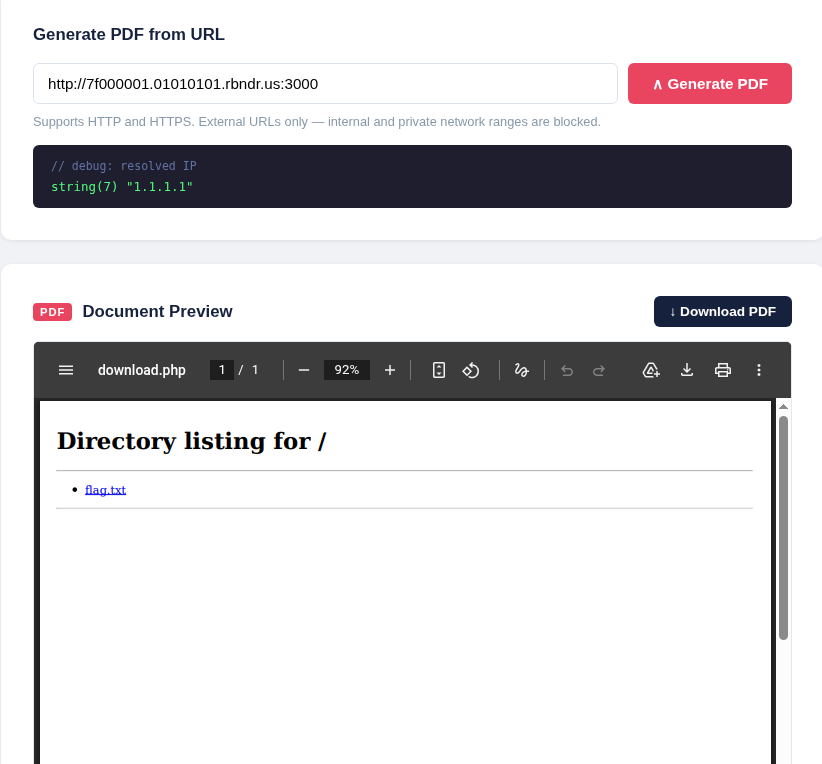
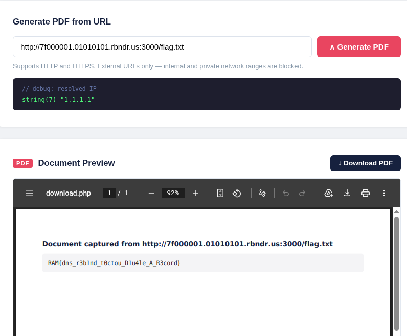

這題因為他會去 fetch 網頁，高機率是 SSRF
看到網頁原始碼可以發現內部服務在 port 3000
```html
<!-- TODO: remove debug endpoints before production push -->
<!-- internal metrics service available on port 3000 (localhost only) -->
```
這題因為是 resolve dne 完以後再進行判斷是否為內部的 ip
所以就利用 dns rebinding attack
他查 dns 的時候是外部 ip，但是請求的時候是請求到內部 ip
可以利用 https://lock.cmpxchg8b.com/rebinder.html 來生成網址
這裡我是用 127.0.0.1 和 1.1.1.1，記得要用 http (內部服務是 http)

