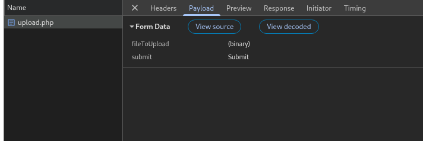

還是要說一下這題有夠低能
先找上傳後的檔案在哪裡
/upload /uploads /file /data /submit 都找過了
最後發現在 /submissions 裡面
我一開始試了 php webshell
上傳 .htaccess 還有各種方法都沒用
後來有人說這題有點 silly
我就想說把上傳時的 submit 拿掉，結果他就不檢查了
用這行指令 curl -i -F 'fileToUpload=@shell.php;filename=shell3.php' http://10.42.69.30/upload.php
我真的很氣之前搞一大堆結果這題這麼簡單，只能說做太少題目了

然後就順利用 webshell 看到 /flag.txt

因為我很氣所以把他的 upload.php 和 index.php 都抓了出來