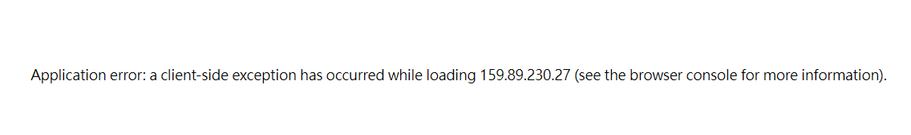
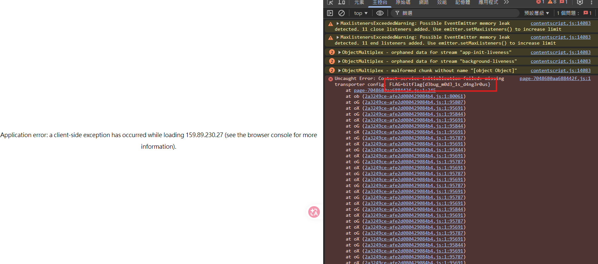

# The Glitchy Contact System

## 題目描述

Something in the marketplace isn't working quite right. Those who dig deeper find more than they bargained for.

## 解題思路

進到 `/contact` 會看到頁面整個壞掉，顯示 client-side exception 的錯誤。



打開 developer tools 的 console，就能看到被丟出來的錯誤訊息裡直接夾帶 flag。



### 原因

這是一個 Next.js app。contact 的 client component 把 server 傳進來的 `flag` prop，在 `useEffect` 裡直接 `throw` 出去：

```js
function i(e){
  let{flag:t}=e;
  return useEffect(()=>{
    throw Error("Contact service initialization failed: missing transporter config. FLAG=".concat(t))
  },[t]),null
}
```

因為 flag 是 server component 當作 prop 傳給 client component，它會被序列化進首頁回傳的 HTML（RSC payload）裡。所以根本不用瀏覽器，直接抓 HTML 就能拿到：

```bash
curl -s http://159.89.230.27/contact | grep -oE 'bitflag\{[^}]*\}'
# bitflag{d3bug_m0d3_1s_d4ng3r0us}
```

## Flag

```text
bitflag{d3bug_m0d3_1s_d4ng3r0us}
```
