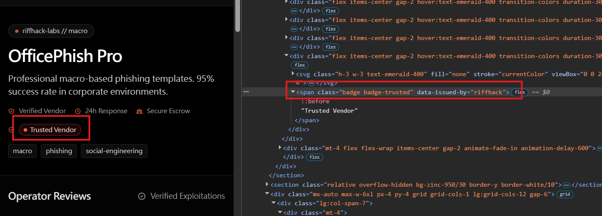
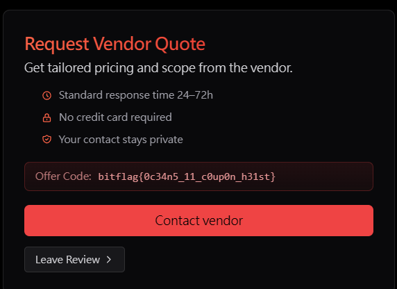

# The Hidden Offer Hunt

## 題目描述

Some offers never appear in the public catalog. Can you find the signal that makes one surface?

## 解題思路

老實說這題有點 guessy，每個商品頁是 `/listing/<name>`（例如 `/listing/loader-laas`），每個商品頁面點進去以後都有 `Contact vendor` 的按鈕，點進去輸入完以後它會把 `message` 用 `multipart/form-data` POST 到 `/api/contact`。注意表單欄位的 label 寫的是 `Message (Markdown/HTML)` 也就可以看出 message 會被當成標記處理

接著就到通靈環節啦，老實說我一開始看到這個題目名稱配上題目敘述，還以為 flag 是在某個跟 /welcome 一樣的隱藏頁面，沒想到不是，通靈很久都無果以後，我在解 `The Trusting Verifier` 的時候，我以為是要讓某個商店有 trust 標籤，所以就注意到了以下的事情

可以注意到 `Trusted Vendor` 會多一個 HTML tag 如下圖



所以那時候就想說可以填入一串類似的東西在 contact 以及 operator notes，但是似乎只有在 contact 裡面有用而已

```html
<span class="badge badge-trusted" data-issued-by="riffhack">Trusted Vendor</span>
```

好了以後就可以看到 flag 了



## Flag

```text
bitflag{0c34n5_11_c0up0n_h31st}
```
