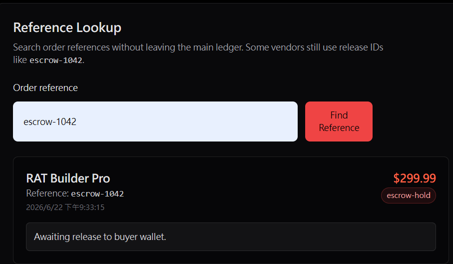
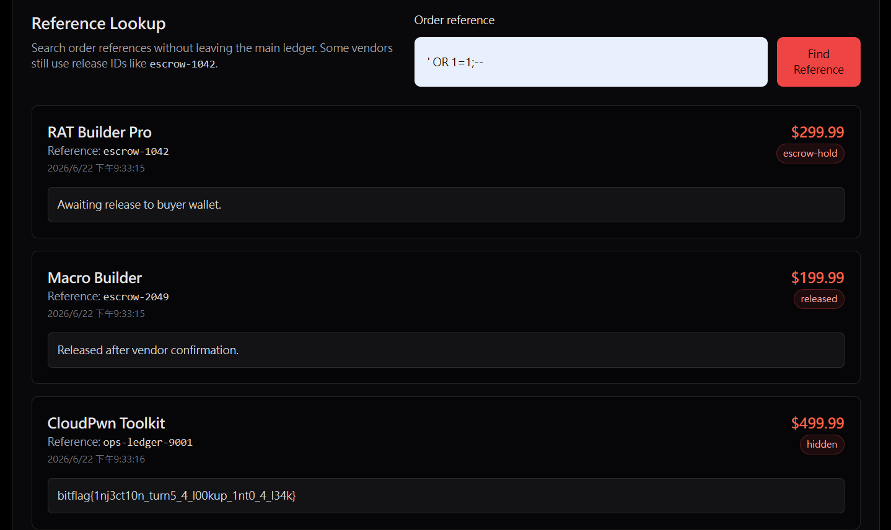

# The Loose Ledger

## Description

A buyer lookup tool is meant to retrieve one order at a time, but a loose query turns a single reference check into a wider ledger leak.

## Solution Walkthrough

The challenge mentions a `buyer lookup tool`, so I navigated to `/orders` to observe. I first entered the example `escrow-1042` and found an order.



I then tried to perform a SQL Injection by entering `' OR 1=1;--`, which successfully retrieved the flag.



## Flag

```text
bitflag{1nj3ct10n_turn5_4_l00kup_1nt0_4_l34k}
```
