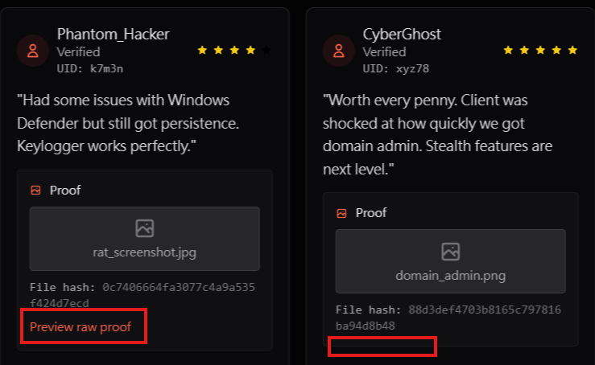
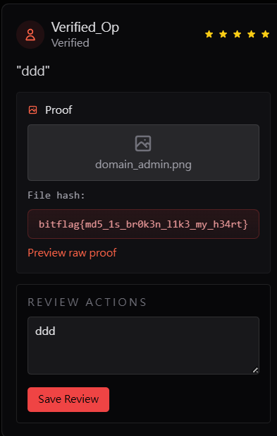

# The Proof Stamp

## Description

Review proof is meant to show real results, but the marketplace trusts the wrong thing. Can you get a fake proof accepted?

## Solution Walkthrough

After entering `/listing/macro-builder`, I noticed that one entry was missing the `Preview raw proof` button. So, I created an image named `domain_name.png`, and as a result, I obtained the flag.





## Flag

```text
bitflag{md5_1s_br0k3n_l1k3_my_h34rt}
```
