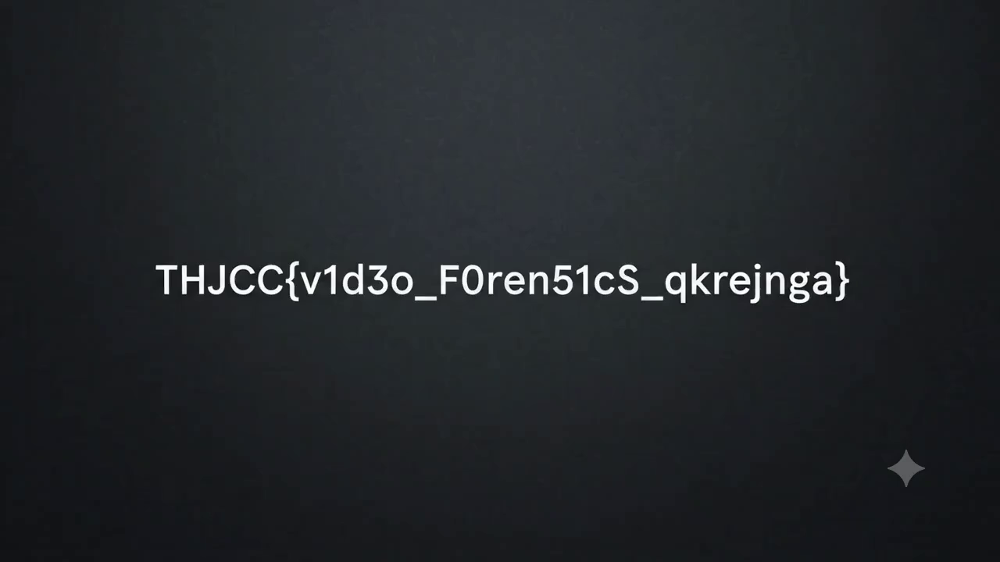

# Afterimage1

## 題目描述

[challenge.mp4](https://ctf2026-sum.thjcc.org/files/59b5ae72b36acbcd80d899ea10afaad6/challenge.mp4)

## 解題思路

先嘗試 lsb 但沒東西，之後就用 strings 看一下，結果發現快結尾的地方有

```text
x264 - core 165 r3223 0480cb0 - H.264/MPEG-4 AVC codec - Copyleft 2003-2025 - http://www.videolan.org/x264.html - options: cabac=1 ref=1 deblock=1:0:0 analyse=0x3:0x113 me=hex subme=7 psy=1 psy_rd=1.00:0.00 mixed_ref=0 me_range=16 chroma_me=1 trellis=1 8x8dct=1 cqm=0 deadzone=21,11 fast_pskip=1 chroma_qp_offset=-2 threads=22 lookahead_threads=3 sliced_threads=0 nr=0 decimate=1 interlaced=0 bluray_compat=0 constrained_intra=0 bframes=0 weightp=0 keyint=1 keyint_min=1 scenecut=0 intra_refresh=0 rc=crf mbtree=0 crf=23.0 qcomp=0.60 qpmin=0 qpmax=69 qpstep=4 ip_ratio=1.40 aq=1:1.00
```

這基本上就是 H.264，但他出現在很後面，所以可以推知他是被藏的那個東西，丟給 ffmpeg 解碼以後就是 flag 了



## Flag

```text
THJCC{v1d3o_F0ren51cS_qkrejnga}
```
