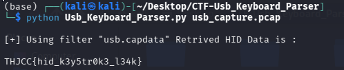

# Afterimage2

## 題目描述

The cybersecurity team discovered an "unidentified cable" connected to a workstation suspected of a data breach. We captured the raw traffic from that line, and the data revealed frequent activity over a period of time.

## 解題思路

這題直接拿 [現成的工具](https://github.com/shark-asmx/CTF-Usb_Keyboard_Parser) 就可以解了



## Flag

```text
THJCC{hid_k3y5tr0k3_l34k}
```
