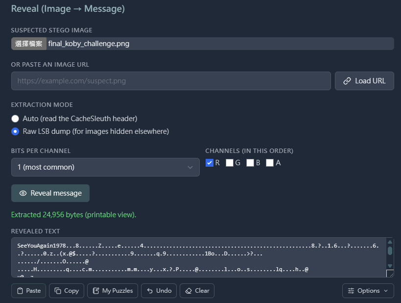

# Man!

## 題目描述

「直升機上的黑盒子損壞了」，只剩下一張最後傳出來的迷因梗圖。你能幫忙重構現場，找到牢大最後留下的遺言嗎？

## 解題思路

老梗了，題目給的圖片末端有一個有密碼的 zip

密碼則是對圖片做 red channel lsb ，做完會得到 `SeeYouAgain1978` (可以用這個網站 https://www.cachesleuth.com/tools/steganography/)



## Flag

```text
THJCC{Man_BA_0ut_Seeyouaga1n_1978}
```
