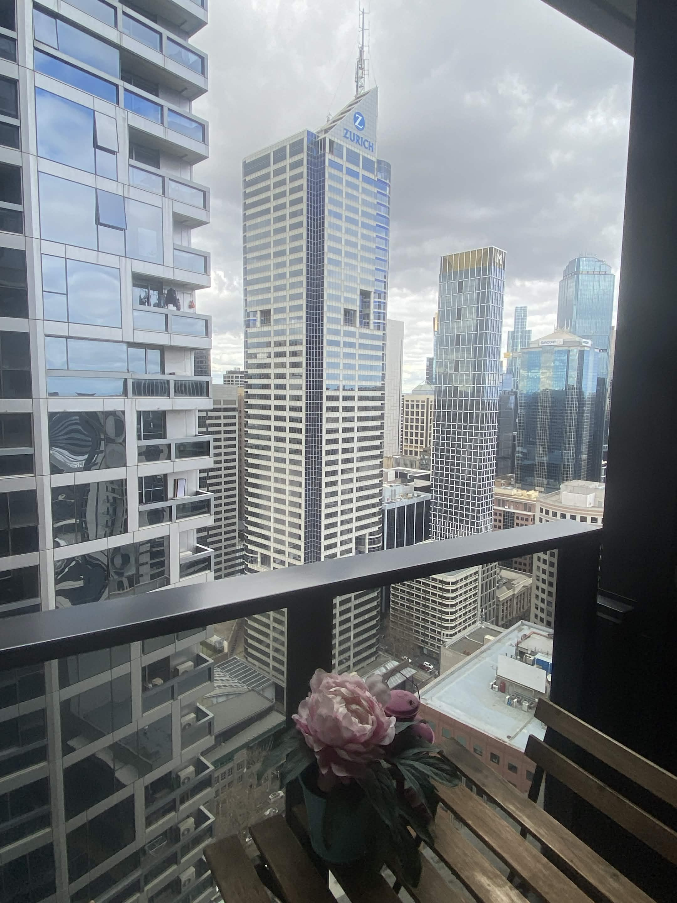
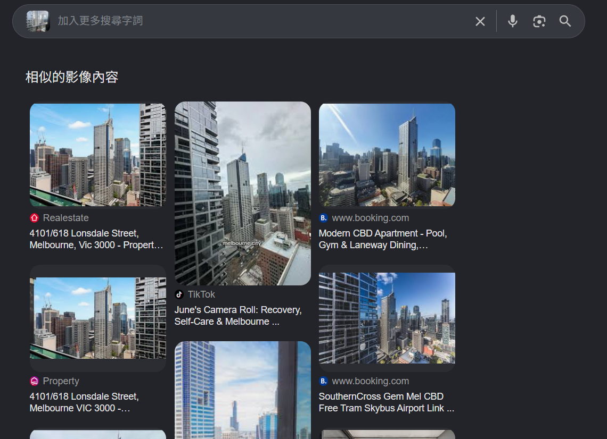
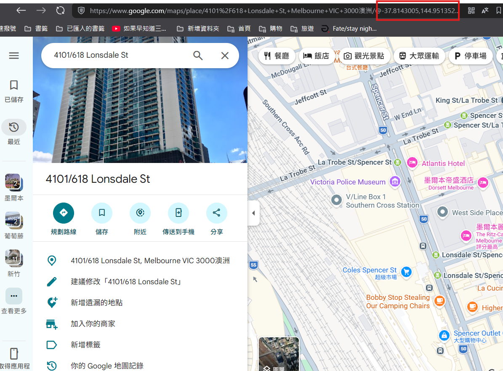

# Time Machine

## 題目描述

Our Head of Challenges went abroad and took a photo during the trip. Can you determine where it was taken?



Submit the location as latitude and longitude, rounded to two decimal places, in the following format:

THJCC{longitude,latitude}

Example: THJCC{121.56,25.04}

## 解題思路

google 以圖搜圖可以發現有訂房網站上面有相似的圖片



點進去以後可以看到地址為 `4101/618 Lonsdale Street, Melbourne, Vic 3000`，去 google maps 直接輸入以後即可得到答案



## Flag

```text
THJCC{144.95,-37.81}
```
