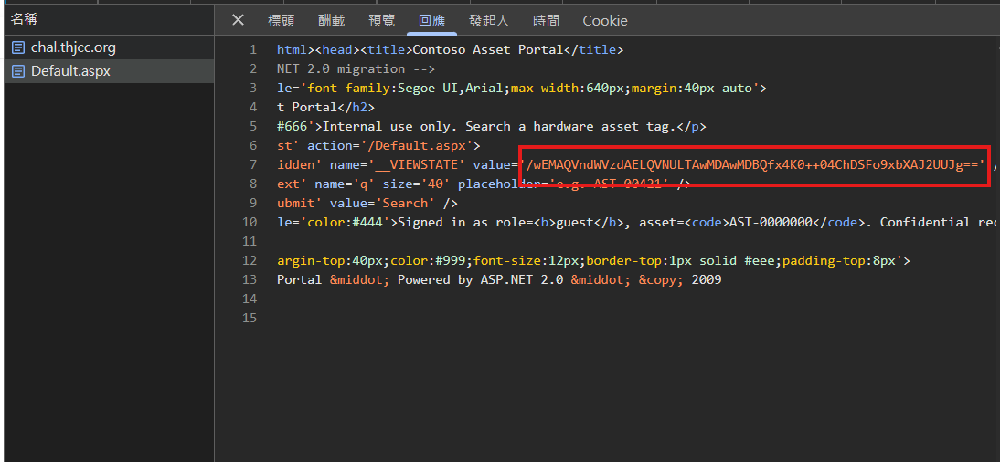
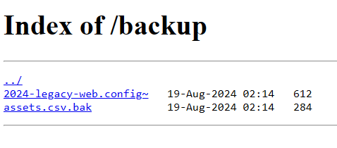
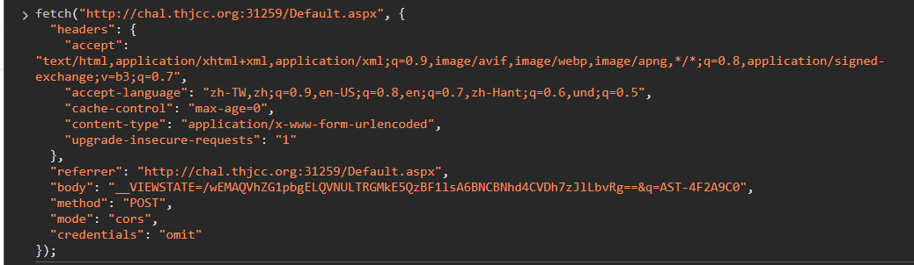
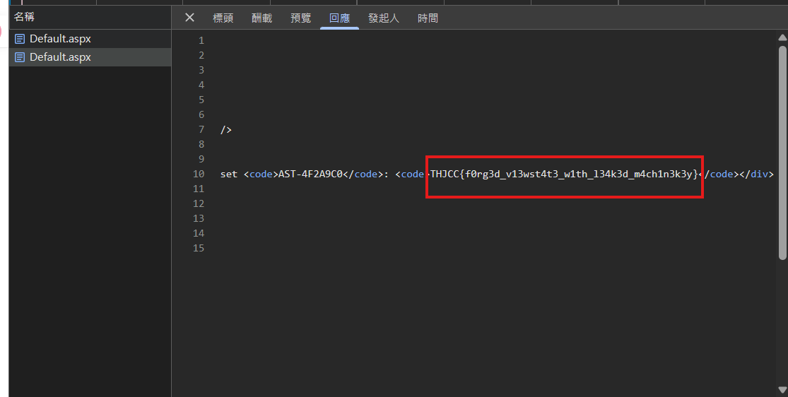

# Contoso Asset Portal

## 題目描述

A legacy internal asset-lookup tool. http://chal.thjcc.org:12022

## 解題思路

原始碼這裡有 `__VIEWSTATE`，所以這題基本上就是要偽造他



去看 `/robots.txt` 可以看到有個 `backup` 的資料夾

```text
User-agent: *
Disallow: /backup/
```

裡面又有兩個檔案



下載下來以後可以看到 `2024-legacy-web.config_`，這東西裡面就是放 key，然後 `assets.csv.bak` 可以看到 `AST-4F2A9C0,Domain Controller,it-admin,restricted`

接下來因為 `validation_key` 都有了，所以改 `__VIEWSTATE` 把他改為 admin 並且可以存取 `AST-4F2A9C0` 即可得到 flag





## Flag

```text
THJCC{f0rg3d_v13wst4t3_w1th_l34k3d_m4ch1n3k3y}
```
