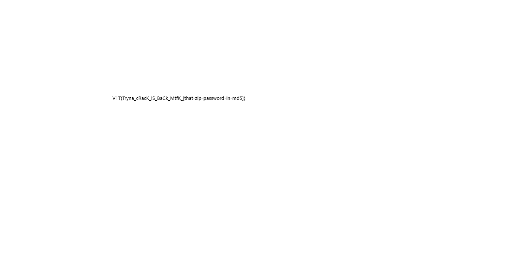

# China Crack? - 101 Writeup

## Description

"This is a Chinese signature and encryption algorithm"
The ZIP password is the same one used in last year’s challenge that sounds similar to this one, go find it.

## Solution Walkthrough

1. **Step 1**：

    Since the challenge says it is similar to last year's challenge, I went to the 2025 V1T CTF and found a challenge with a similar-sounding name: Tryna crack? (forensics).

    https://2025.v1t.site/challenges/

    Since the challenge says the ZIP password appeared last year, I looked for other people's writeups online as a reference:

    https://yocchin.hatenablog.com/entry/2025/11/03/105306

    I found this:

    ```text
    D4mn_br0_H0n3y_p07_7yp3_5h1d
    ```

    Then I was able to open the compressed file.

2. **Step 2**：

    After converting the data inside .secret from binary to ASCII, it becomes `sqrt(SMSM)`. Combined with the challenge hint about a Chinese signature and encryption algorithm, we can infer that it is SM2.

    The file also says `.secret = zip_password + _V1T`, so it becomes:

    ```text
    D4mn_br0_H0n3y_p07_7yp3_5h1d_V1T
    ```

    This can be used exactly as the private key. After decrypting the challenge with SM2, we get:

    

    ```text
    V1T{Tryna_cRacK_iS_BaCk_MtfK_[that-zip-password-in-md5]}
    ```

    Therefore, the flag is:

    ```text
    V1T{Tryna_cRacK_iS_BaCk_MtfK_dffdf21a13908662e27d8c5c875809e4}
    ```

## Flag

```text
V1T{Tryna_cRacK_iS_BaCk_MtfK_dffdf21a13908662e27d8c5c875809e4}
```
