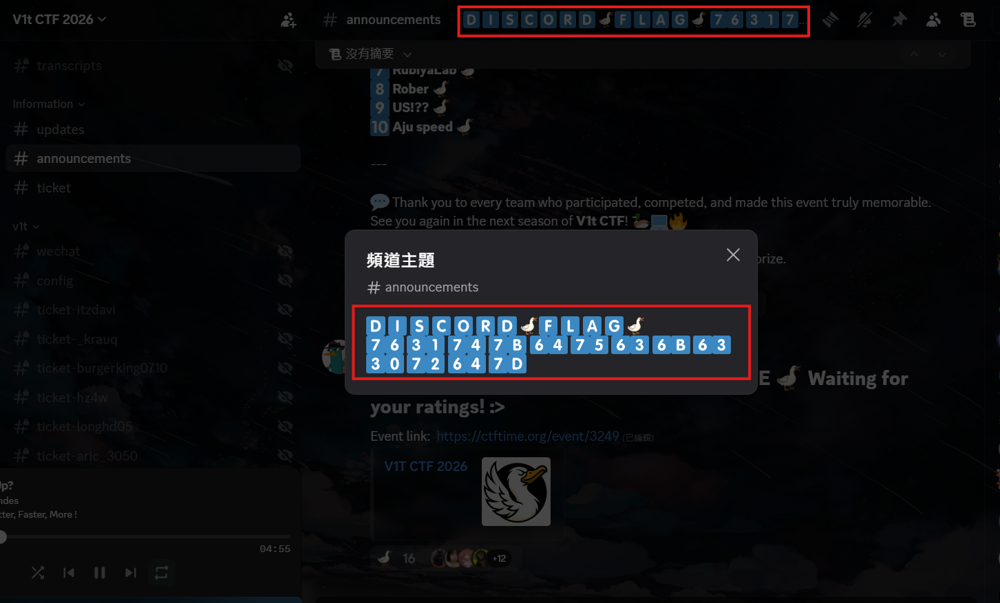
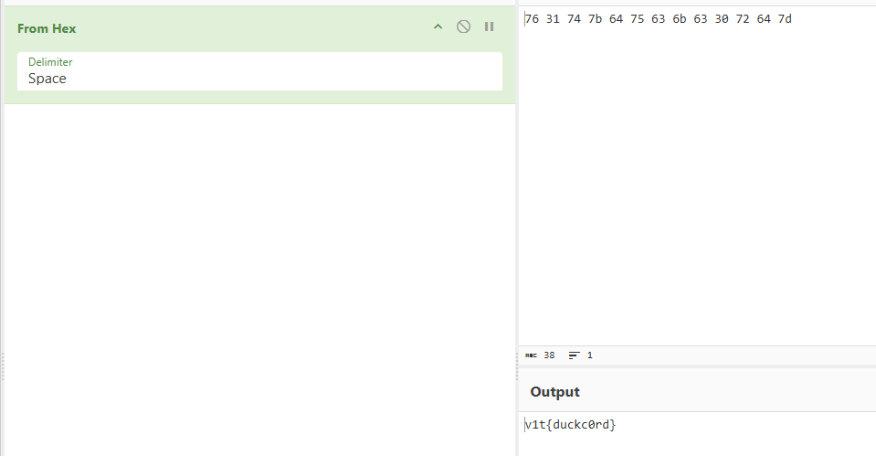

# Discord

## 題目描述

Welcome to discord

https://discord.com/invite/WyYTC2EZqK

## 解題思路


去到 `#announcements` 可以看到 description 裡面有一串數字，把他變成 utf-8 以後就是 flag 了





## Flag

```text
v1t{duckc0rd}
```
