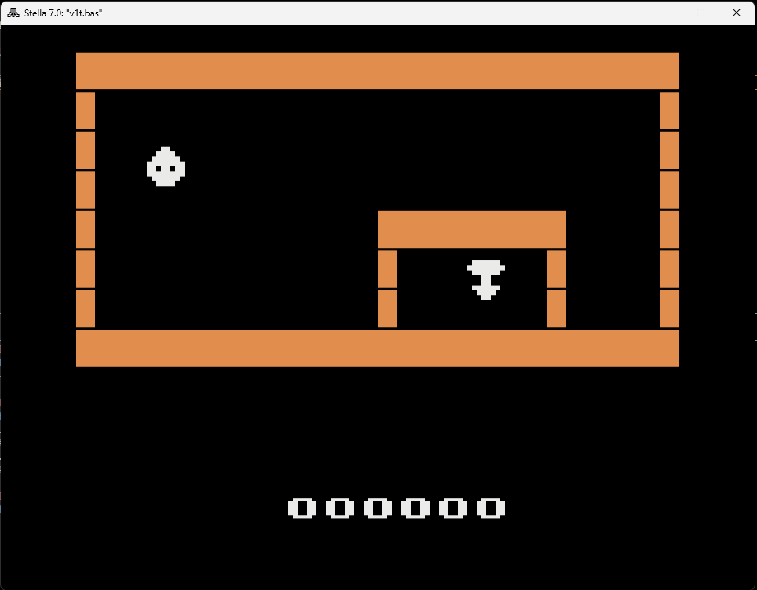
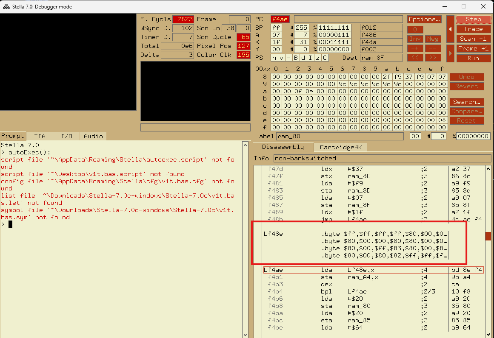
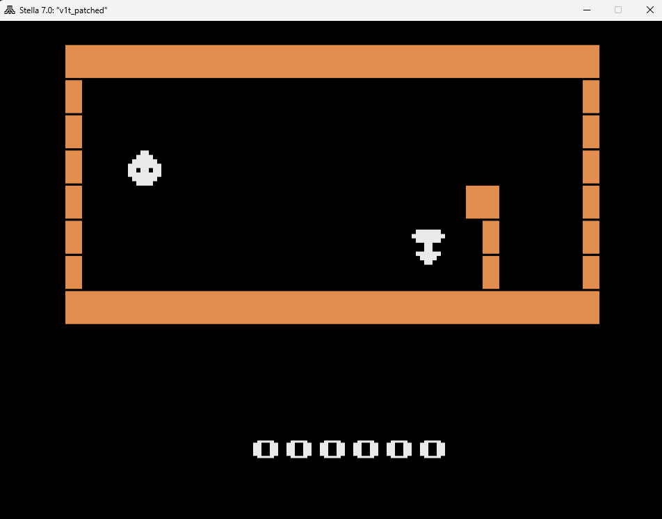
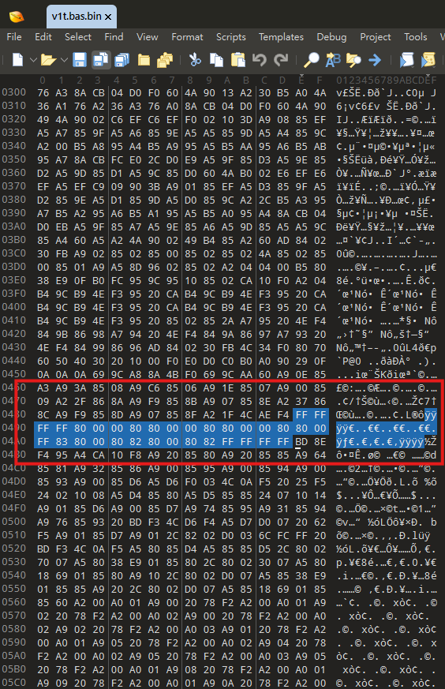
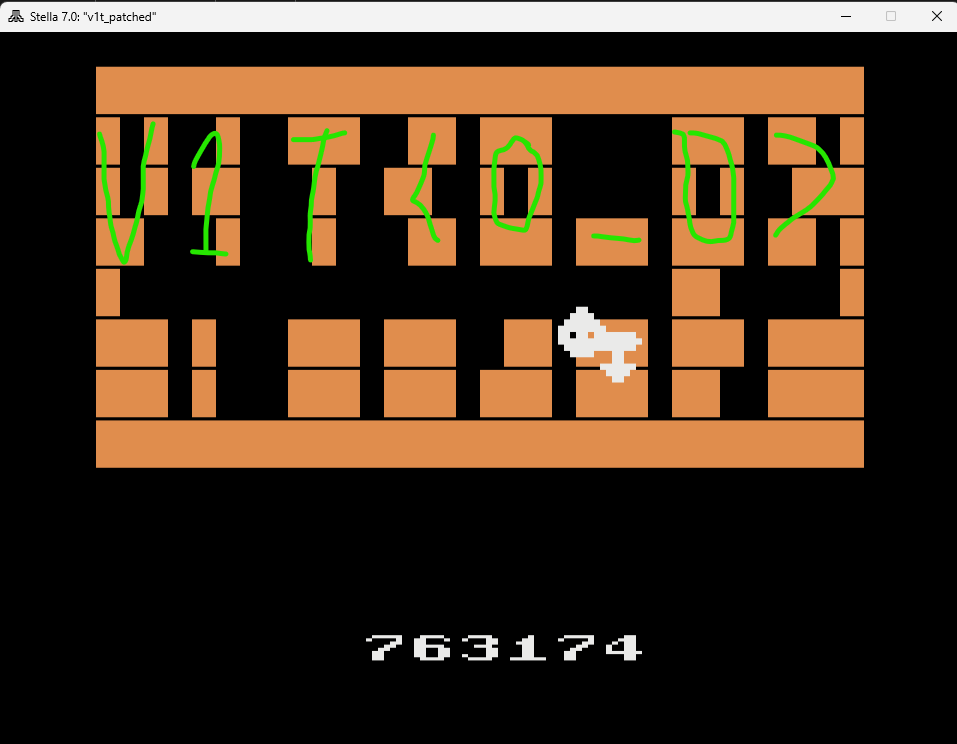

# Atari 2600

## 題目描述

Can you get that prize ?

## 解題思路

題目名稱是 Atari 2600，他又給一個 bin file，所以找個模擬器就能跑遊戲了

左邊的那個點是玩家可以控制的東西，撞到牆壁的話遊戲就會停止，我猜是要碰到右下角的那個點就能拿到 flag，然而它的四周都是牆壁，所以理論上是不可能通關的



之後查了一下就用 DiStella 產出了一個 `v1t.asm` (因為他 windows 有問題所以我在 linux 上 build 一個然後使用 `./distella -pafs v1t.bas.bin > v1t.asm`)

這時候有幾個解法，一個是改地圖，另一個是得知印出 flag 的邏輯，我覺得改地圖比較簡單，因為說實在我看不太懂 `v1t.asm`，所以就先用 stella 內建的 debugger 來查看他地圖是存在哪裡

```text
.\Stella.exe -debug .\v1t.bas.bin
```

按了不知道幾下 step 以後可以發現程式好像讀取了 `Lf48e` 裡面的 data，所以就去研究了一下看他是不是地圖



```text
LF48E: .byte $FF,$FF,$FF,$FF,$80,$00,$00,$80,$80,$00,$00,$80,$80,$00,$00,$80
       .byte $80,$00,$FF,$83,$80,$00,$80,$82,$80,$00,$80,$82,$FF,$FF,$FF,$FF
```

排列以後可以把他變成這樣

```text
FF FF FF FF
80 00 00 80
80 00 00 80
80 00 00 80
80 00 FF 83
80 00 80 82
80 00 80 82
FF FF FF FF
```

可以推測 FF 是天花板和地板，80 是牆壁，82 和 83 我不知道是什麼，雖然和完整得尺寸不符合，但是還是試試看，並且可以推測底下這幾行就是障礙物

```text
80 00 FF 83
80 00 80 82
80 00 80 82
```

反正改成下面的以後就會發現有一半的牆壁被清空了

```text
FF FF FF FF
80 00 00 80
80 00 00 80
80 00 00 80
80 00 00 83
80 00 00 82
80 00 00 82
FF FF FF FF
```



改的方法是在 `v1t.bas.bin` 裡面找到原本的地圖資料，然後就可以改了，我是弄了一個 python 腳本



之後碰到右下角的那個點就能拿到 flag



之後我問 ai 為什麼地圖大小不一樣，他跟我說程式讀完地圖以後會被放大

## Flag

```text
v1t{0_0}
```
