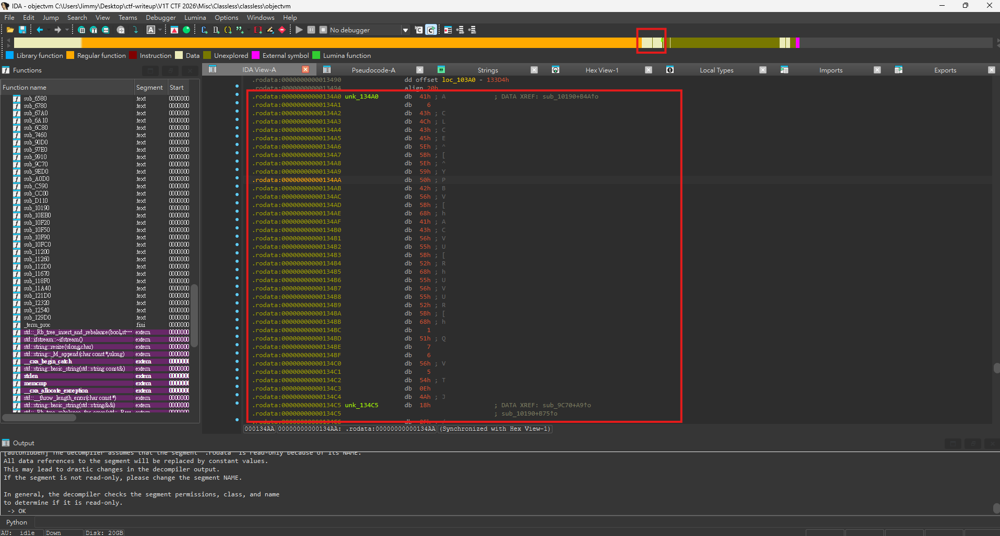
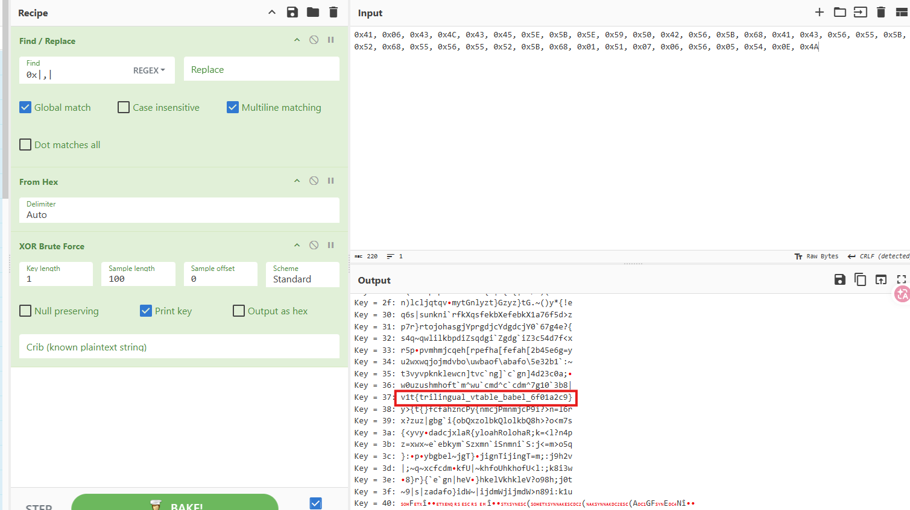
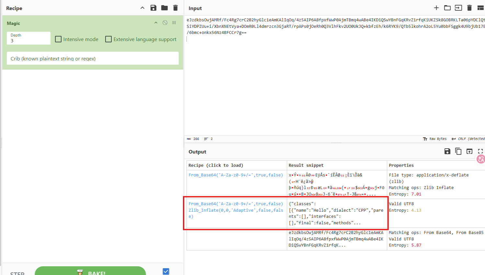
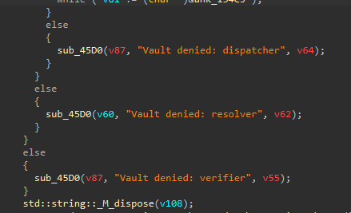
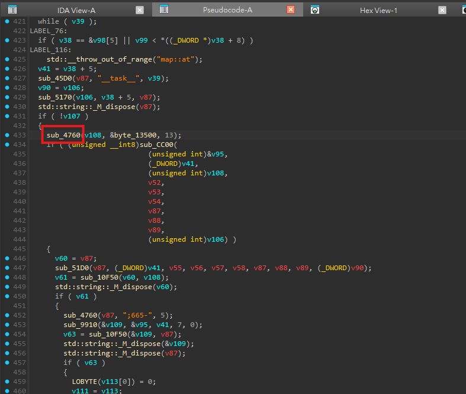
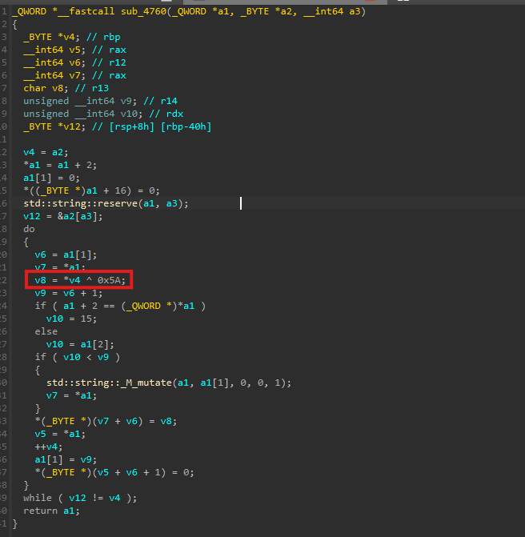

# Classless

## 題目描述

Ever learnt OOP? If yes? Good, now forget what a class is xD

## 解題思路

### 解法一

整份先用 strings 沒看到東西，接著看 `.rodata`，阿這個 `objectvm` 他沒有很多 `.rodata`，所以我打算直接找 flag，可以看到底下的一段有點 sus 的東西



```text
0x41, 0x06, 0x43, 0x4C, 0x43, 0x45, 0x5E, 0x5B, 0x5E, 0x59, 0x50, 0x42, 0x56, 0x5B, 0x68, 0x41, 0x43, 0x56, 0x55, 0x5B, 0x52, 0x68, 0x55, 0x56, 0x55, 0x52, 0x5B, 0x68, 0x01, 0x51, 0x07, 0x06, 0x56, 0x05, 0x54, 0x0E, 0x4A
```

話不多說直接 xor bruteforce，然後發現跟 `0x37` xor 以後就是 flag 了



### 解法二

用 cyberchef 把 bbl 的內容放進去，接著使用 magic 即可發現他其實是 json -> zlib 壓縮 -> base64 encode



可以發現 json 裡面有三個主要欄位

```json
{
  "classes": [...],
  "objects": [...],
  "entry": 1
}
```

其中 `classes` 定義 class、method、slot、visibility、body；`objects` 則定義實際物件的 `declared_class`、`runtime_class`、`fields` 以及 `vtable`，也就是說這個程式其實是一個簡單的 object VM，會根據 JSON 裡定義的 class/object 去模擬 class dispatch、interface、MRO、vtable 等行為

拿 sample 的輸出如下

```text
hello from objectvm
interface Greeter: yes
resolved class: Cat
dispatch slot 7: allow
Vault denied: verifier
```

`04_denied.bbl` 比較 sus，可能代表他有個 vault，這代表 binary 裡面應該有一段隱藏的 vault 邏輯，只是 sample 還沒有通過檢查，仔細看可以發現他有幾個驗證的步驟



```text
verifier -> resolver -> dispatcher
```

可以看到 `sub_4760`，他就是一個專門對 `0x5A` 做 xor 的函式





所以第一關 verifier 應該是在檢查目前的 object 是否能被視為 `TrustedPlugin`

接著看 resolver 的部分，hidden vault 通過 verifier 之後會呼叫

```c
sub_51D0(v87, (_DWORD)v41, ...);
v61 = sub_10F50(v60, v108);
```

其中 v108 就是剛剛解出來的 `TrustedPlugin`，所以這裡是在檢查 `sub_51D0` 回傳的字串是否等於 `TrustedPlugin`

點進 `sub_51D0` 可以看到

```c
__int64 __fastcall sub_51D0(__int64 a1, __int64 a2)
{
  _QWORD v3[4];
  _QWORD v4[11];

  sub_4760(v4, byte_134F0, 9);
  sub_5170(v3, a2, v4);
  std::string::_M_dispose(v4);

  if ( v3[1] )
    std::string::basic_string(a1, v3);
  else
    std::string::basic_string(a1, a2 + 40);

  std::string::_M_dispose(v3);
  return a1;
}
```

這裡又呼叫了一次 `sub_4760`

```c
sub_4760(v4, byte_134F0, 9);
```

把 `byte_134F0` xor `0x5A` 之後可以得到 `__class__`，所以 `sub_51D0` 其實會先從 object 的 fields 裡面找 `__class__` 這個欄位，如果有找到就回傳 `fields["__class__"]`，如果沒有找到就回傳 object 原本的 class，也就是 `a2 + 40`

接著 `sub_10F50` 是字串比較函式，所以 resolver 只要 object 的 `fields` 裡面有

```json
"fields": {
  "__class__": "TrustedPlugin"
}
```

接著看 dispatcher 的部分

```c
sub_4760(v87, ";665-", 5);
sub_9910(&v109, &v95, v41, 7, 0);
v63 = sub_10F50(&v109, v87);
```

這邊 `sub_4760(v87, ";665-", 5)` 一樣是 xor `0x5A`，所以 `";665-"` 解出來會是 `allow`，所以 dispatcher 這關就是要求 vtable[7] dispatch 出來的結果必須是 allow

如果 verifier、resolver、dispatcher 都通過，就會進到成功路徑，也就是真正解 flag 的地方，所以 hidden vault 的整體邏輯可以整理成

```c
if (obj.fields["__task__"].empty()) {
    trusted = xor_decode(byte_13500, 13, 0x5A); // "TrustedPlugin"

    if (!verifier(vm, obj, trusted)) {
        puts("Vault denied: verifier");
        return;
    }

    resolved = resolve_class(obj); // fields["__class__"] or runtime_class

    if (resolved != trusted) {
        puts("Vault denied: resolver");
        return;
    }

    expected = xor_decode(";665-", 5, 0x5A); // "allow"
    result = dispatch_slot(vm, obj, 7);

    if (result != expected) {
        puts("Vault denied: dispatcher");
        return;
    }

    flag = xor_decode(unk_134A0, 37, 0x37);
    puts(flag);
}
```

## Flag

```text
v1t{trilingual_vtable_babel_6f01a2c9}
```
