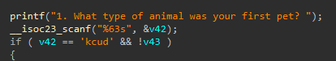
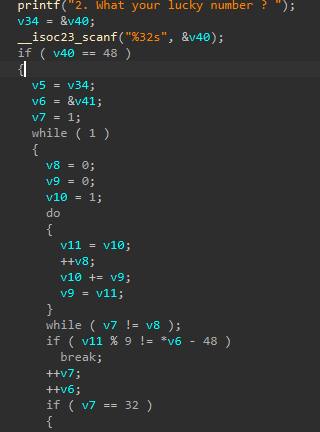

# Diddy License Checker

## Description

giggle

## Solution Walkthrough

After opening `diddy` in IDA, we can see that it asks three questions. For the third question, it even sends an HTTP request, which means we probably cannot get the flag directly through static analysis alone.

The first question is very simple. The correct answer is `duck`.



For the second question, it checks whether your first character is `0`, and then starts calculating the Fibonacci sequence. So the answer is:

`01123584371808876415628101123584`



For the third question, it goes to `aHR0cDovL3YxdC5zaXRlLw==`, which is `http://v1t.site`, and then looks for the license we just entered. In other words, it sends an HTTP GET request to:

`http://v1t.site/<licence>`

Since I had coincidentally seen while working on another challenge that their website was hosted using GitHub Pages, and that there was a `license-for-user-deadbeef-diddy` inside, the license was obviously that.

```c
if (v7 == 32)
{
    printf("3. Enter your license name: ");
    __isoc23_scanf("%63s", v44);
    v12 = (void *)base64_decode("aHR0cDovL3YxdC5zaXRlLw==");
    ptr = v12;
    *((_BYTE *)v12 + v35) = 0;
    sprintf(s, "%s%s", (const char *)v12, v44);
    v33 = (void *)http_get(s);
    v13 = arr_len;
    v14 = alloca(arr_len);
    p_ptr = &ptr;
    xor_bytes(&arr, (unsigned int)arr_len, v44, &ptr);
    v31 = v13 / 2;
    v16 = alloca(v13 / 2);
    v32 = &ptr;
    if (v13 > 0)
    {
        v17 = &ptr;
        do
        {
            __isoc23_sscanf(p_ptr, "%2hhx", v17);
            v4 += 2;
            p_ptr = (void **)((char *)p_ptr + 2);
            v17 = (void **)((char *)v17 + 1);
        } while (arr_len > v4);
    }
    v18 = (char *)v33;
    v30 = v38;
    v19 = v38;
    do
    {
        __isoc23_sscanf(v18, "%2hhx", v19++);
        v18 += 2;
    } while (v39 != v19);
    v20 = v39;
    v21 = v34 + 32;
    do
    {
        __isoc23_sscanf(v5, "%2hhx", v20);
        v5 += 2;
        ++v20;
    } while (v21 != v5);
    v22 = 0;
    v23 = EVP_CIPHER_CTX_new();
    v24 = EVP_aes_128_cbc();
    EVP_DecryptInit_ex(v23, v24, 0, v30, v39);
    EVP_DecryptUpdate(v23, v46, &v36, v32, v31);
    EVP_DecryptFinal_ex(v23, &v46[v36], &v37);
    v36 += v37;
    EVP_CIPHER_CTX_free(v23);
    v25 = v36;
    LODWORD(v25) = v36;
    v26 = v36 >> 31;
    v27 = v36;
    v46[v25] = 0;
    v28 = (int)(__SPAIR64__(v26, v25) / 2);
    if (v27 > 1)
    {
        do
        {
            __isoc23_sscanf(&v46[2 * v22], "%2hhx", &s1[v22]);
            ++v22;
        } while ((int)v28 > (int)v22);
    }
    s1[v28] = 0;
    if (!strncmp(s1, "v1t", 3u))
    {
        printf("Oh hi diddy here your flag: %s\n", s1);
        free(ptr);
        free(v33);
        return 0;
    }
    break;
}
```

~~Finally, after opening the program and entering the three answers above, we can get the flag.~~ Nope, we cannot. I also had no idea why. Oh, it turns out my antivirus software was blocking it.

Anyway, I followed the approach above, wrote a `solution.py`, and then got the flag.


## Flag

```text
v1t{435_f1b0_w3bs1t3}
```
