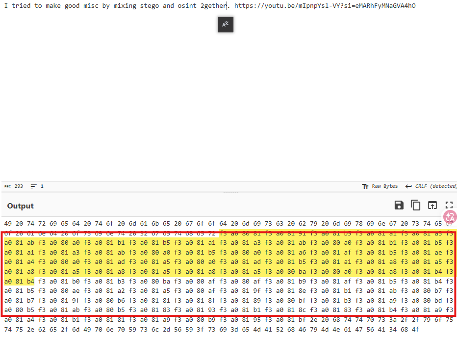
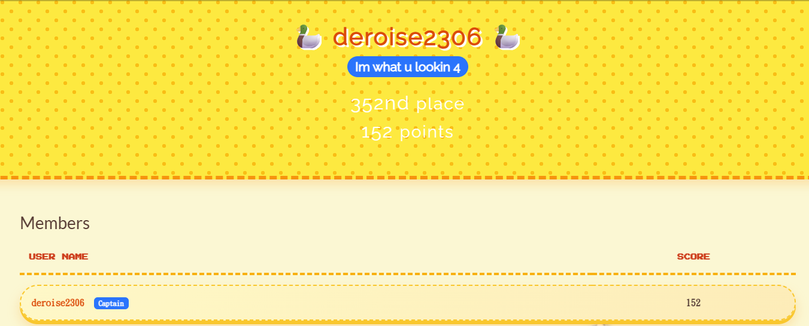
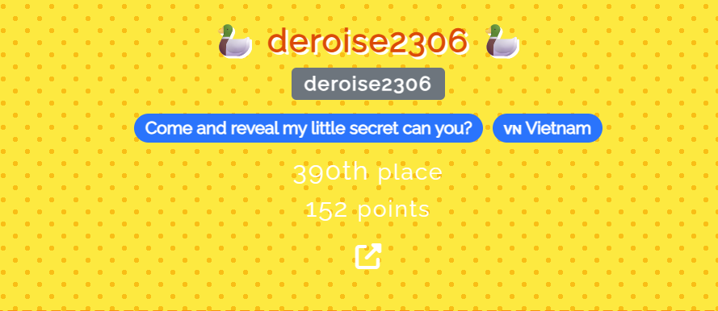
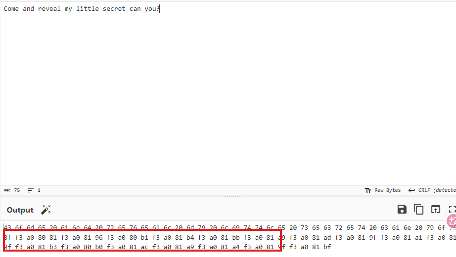

# Huh!?

## 題目描述

I tried to make good misc by mixing stego and osint 2gether󠀁󠁑󠁵󠁡󠁣󠁫󠀠󠁱󠁵󠁡󠁣󠁫󠀠󠁱󠁵󠁡󠁣󠁫󠀠󠁵󠀠󠁦󠁯󠁵󠁮󠁤󠀠󠁭󠁥󠀠󠁭󠁵󠁡󠁨󠁥󠁨󠁥󠁨󠁥󠁨󠁥󠀺󠀠󠁨󠁴󠁴󠁰󠁳󠀺󠀯󠀯󠁹󠁯󠁵󠁴󠁵󠀮󠁢󠁥󠀯󠁟󠁎󠁱󠁫󠀷󠁷󠁟󠀶󠁁󠁏󠁉󠀿󠁳󠁩󠀽󠀵󠁫󠀵󠁃󠁓󠁱󠁌󠁃󠁴󠁩󠁤󠁱󠁁󠁩󠀹󠁕󠁿. https://youtu.be/mIpnpYsl-VY?si=eMARhFyMNaGVA4hO

## 解題思路

Opening the challenge and looking closely, you can spot `Unicode tag characters`.



Besides [this video](https://www.youtube.com/watch?v=mIpnpYsl-VY), you’ll also see [one extra video](https://www.youtube.com/watch?v=_Nqk7w_6AOI). Anyway, both of them are talking about the scoreboard.

So I went to the scoreboard and searched for the challenge tag, `deroise2306`.





Looking carefully, it’s not hard to see that `Come and reveal my little secret can you?` contains `Unicode tag characters`, which gives the first part of the flag: `V1t{im_a_s0lid_`



Next, I clicked the link on his [profile](https://pastebin.com/bCdN90ep), went to Pastebin, and then opened the [Mega link](https://mega.nz/file/mxIwSDDa#_JTS1ENZPanU-fYsbo7ptzDaMtZuXR9peB6mLYSh23U), where I found a file called `Huh.wav`.

I tried using `strings` to search for the flag, Mega links, or Pastebin links, but found nothing. I also checked the spectrogram and didn’t see anything useful either. Ended up wasting over an hour on that.

After that, I started testing in the direction of LSB steganography. After messing with it for a few more hours, I finally found that if you extract the least significant bit of every byte in the `data` chunk, then group the bits MSB-first into bytes every 8 bits, you can recover a Mega link.

After analyzing that, I got another [Mega link](https://mega.nz/file/DohSlCpB#3CQyY1OUnmmAgCOKLKPesgsGX3Mr2-t_qG9H3J1OGuE), where there was a file named `4nh_d0_p1x1.txt`. The filename was obviously there to mess with people. The file is made up of 0s and 1s, so it’s not hard to tell that it’s a QR code.

After scanning it, I found the final [Mega link](https://mega.nz/file/upxyGCpa#xx5eEWZM92TEDuiyYqyYsoBnaosbwaNfKyyF7Grb9Eo), which contained `QK1_8101.CR2`. Running `strings` on it directly reveals the last part of the flag: `_c4non_f4nboy}`

Putting the two parts of the flag together gives the final flag.

I have to say, this challenge was really damn troll. Who the hell puts two underscores there? I spent forever trying `V1t{im_a_s0lid_4nh_d0_p1x1_c4non_f4nboy}` and it kept being wrong. Maybe whoever made this challenge should go make more challenges like this.

## Flag

```text
V1t{im_a_s0lid__c4non_f4nboy}
```
