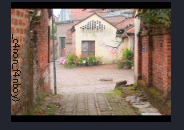
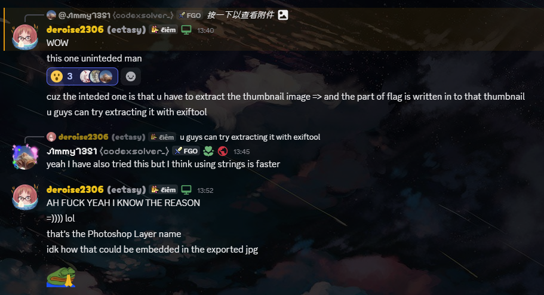

# Huh!?

## 題目描述

I tried to make good misc by mixing stego and osint 2gether󠀁󠁑󠁵󠁡󠁣󠁫󠀠󠁱󠁵󠁡󠁣󠁫󠀠󠁱󠁵󠁡󠁣󠁫󠀠󠁵󠀠󠁦󠁯󠁵󠁮󠁤󠀠󠁭󠁥󠀠󠁭󠁵󠁡󠁨󠁥󠁨󠁥󠁨󠁥󠁨󠁥󠀺󠀠󠁨󠁴󠁴󠁰󠁳󠀺󠀯󠀯󠁹󠁯󠁵󠁴󠁵󠀮󠁢󠁥󠀯󠁟󠁎󠁱󠁫󠀷󠁷󠁟󠀶󠁁󠁏󠁉󠀿󠁳󠁩󠀽󠀵󠁫󠀵󠁃󠁓󠁱󠁌󠁃󠁴󠁩󠁤󠁱󠁁󠁩󠀹󠁕󠁿. https://youtu.be/mIpnpYsl-VY?si=eMARhFyMNaGVA4hO

## 解題思路

打開題目仔細看可以看到 `Unicode tag characters`


除了[這部影片](https://www.youtube.com/watch?v=mIpnpYsl-VY)，還會看到[一部額外的影片](https://www.youtube.com/watch?v=_Nqk7w_6AOI)，反正兩個都在說 scoreboard

於是來到 scoreboard，搜尋題目的 tag `deroise2306`


仔細看不難看出 `Come and reveal my little secret can you?󠀁󠁖󠀱󠁴󠁻󠁩󠁭󠁟󠁡󠁟󠁳󠀰󠁬󠁩󠁤󠁟󠁿` 有 `Unicode tag characters`，於是得到第一部分的 flag `V1t{im_a_s0lid_`


接著點進去他[主頁的連結](https://pastebin.com/bCdN90ep)，進到 pastebin，再進去 [mega 連結](https://mega.nz/file/mxIwSDDa#_JTS1ENZPanU-fYsbo7ptzDaMtZuXR9peB6mLYSh23U)，可以看到一部 `Huh.wav`

用 strings 去找 flag 或是 mega 或是 pastebin 連結都找不到，然後觀察 spectrogram 也沒看到有用的東西，就這樣搞了一個多小時

之後就往 LSB steganography 的方向測試，又搞了幾個小時最後發現將 `data` chunk 中每個 byte 的最低位元取出，並以 MSB-first 每 8 bit 組成一個 byte，就能還原出一段 Mega 連結

對他分析分析以後就可以得到另一個 [mega 連結](https://mega.nz/file/DohSlCpB#3CQyY1OUnmmAgCOKLKPesgsGX3Mr2-t_qG9H3J1OGuE)，可以看到 `4nh_d0_p1x1
.txt`，這個檔名搞人用的，它由 0 和 1 組成，不難看出他是一個 QRcode

掃進去以後可以看到最後一個 [mega 連結](https://mega.nz/file/upxyGCpa#xx5eEWZM92TEDuiyYqyYsoBnaosbwaNfKyyF7Grb9Eo)，可以看到 `QK1_8101.CR2`，直接用 strings 可以發現最後一段 flag `_c4non_f4nboy}`

不過作者說 intended solution 是要用 exiftool 把 thumbnail 提取出來，指令如下 `exiftool -b -ThumbnailImage QK1_8101.CR2 > thumbnail.jpg`





把兩段 flag 合在一起以後就是最終的 flag 了

不得不說這題真的很糖，哪有人底線放兩個，智障嗎我試半天 `V1t{im_a_s0lid_4nh_d0_p1x1_c4non_f4nboy}` 結果都錯，出這題的人要不要自己去跳一跳算了

## Flag

```text
V1t{im_a_s0lid__c4non_f4nboy}
```
