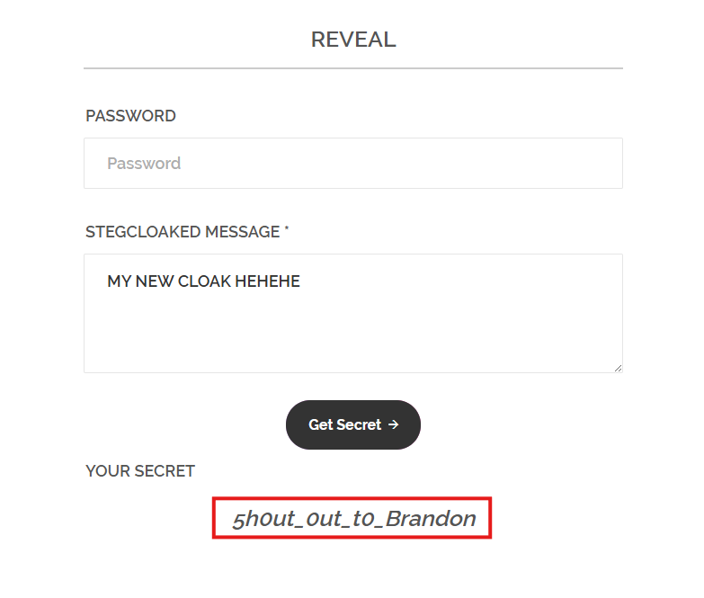
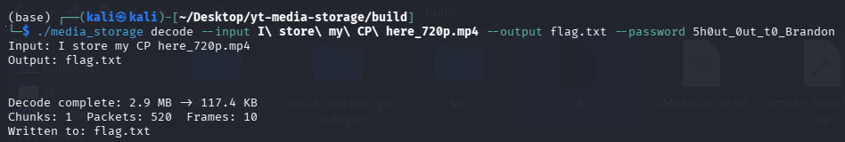
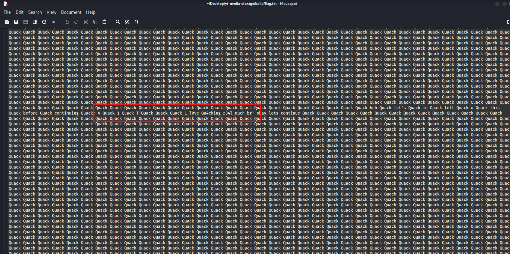

# New Way to store my CP (Collections of Photos)

## 題目描述

Recently, I put all my money into 1xbet and now I'm broke af. I found a good way to store my 36GB CP and I will share u guys below. https://pastebin.com/899yXPGK

## 解題思路


點進去他給的網站可以看到一個文字檔，可以看到一個 youtube 連結，此外這個文字檔往下滑到最底，可以看到一串很 sus 的字串 `MY ⁤⁡⁢‌⁣⁡‍‍⁤‌⁤⁡‌⁣⁡‌⁡⁢⁣‌‌‌⁢⁡⁤⁢⁡⁢⁡‌⁡⁤‌⁤⁣‌‌⁡⁤‍⁡‌⁢‍⁡‍⁢⁣‍‌‍⁡‍⁡⁢⁡‍‌‌⁡‍‌‍NEW CLOAK HEHEHE`

可以看到字串裡面有 cloak，於是就去 `https://stegcloak.surge.sh` 輸入剛剛的那串字串，就可以得到 `5h0ut_0ut_t0_Brandon`



看到之前拿到的 youtube 連結，可以想到是[這個專案](https://github.com/PulseBeat02/yt-media-storage)，所以把 youtube 上的影片以**最高畫質**下載下來 (畫質太低會失敗)，並用指令 `./media_storage decode --input cp.mp4 --output flag.txt --password 5h0ut_0ut_t0_Brandon`



之後就可以看到一個充滿 Quack 的檔案，往下滑就可以看到 flag 了



## Flag

```text
V1T{Quack_Quack_Quack_1_l0ve_Qu4cking_r34l_much_br}
```
