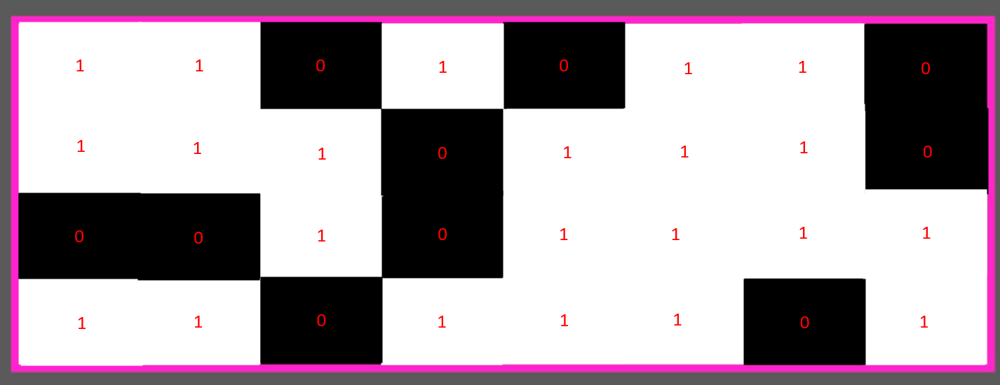
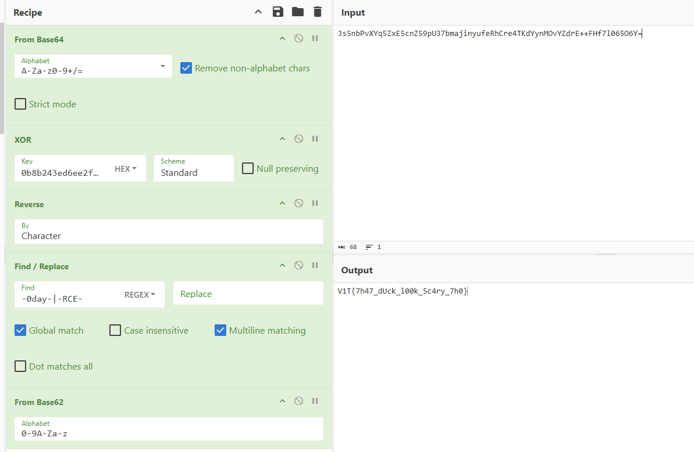

# Scảry Duck

## 題目描述

Can you peel back all the layers of protection and find the flag?

Good luck!

## 解題思路

下載下來以後會看到壓縮檔裡面是一個 challenge.mp4，前面是 AI slop 的影片，倒數三秒左右會出現很 sus 的聲音還有影像

那個圖片把白色當 1 黑色當 0 就可以得到 `11010110 11101110 00101111 11011101`，轉成 hex 以後是 `D6EE2FDD`



接著是聲音，總共有八個不同頻率的聲音，頻率分別為 `600, 2250, 1800, 2250, 900, 1200, 1050, 2700`，不難注意到他們都是 150 的倍數

將他們扣掉 600 再除以 150 以後會得到 `0 11 8 11 2 4 3 14`，接著轉成 hex，會變成 `0B8B243E`

排列組合一下最後發現密碼是 `0b8b243ed6ee2fdd`

接著可以看到 `solver.py` 和 `flag.enc`，`solver.py` 應該改為 `encrypt.py` 才對，不管怎麼說，流程就是 `reverse -> xor -> base64 encode`

```py
@base64_layer
@xor_layer
@reverse_layer
def encode(data: bytes) -> bytes:
    return data
```

好所以照上面來，並且 xor key 使用上面得到的 `0b8b243ed6ee2fdd`，就會得到一串字串 `-0day-I05Dqrhk0WASzcVa4EovsSduXJpFxRpKbjORsM9-RCE-`，中間的 `I05Dqrhk0WASzcVa4EovsSduXJpFxRpKbjORsM9` 用 base62 decode 就可以得到 flag 了，流程如下



## Flag

```text
V1T{7h47_dUck_l00k_5c4ry_7h0}
```
