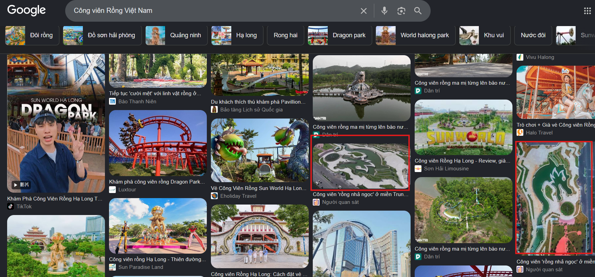
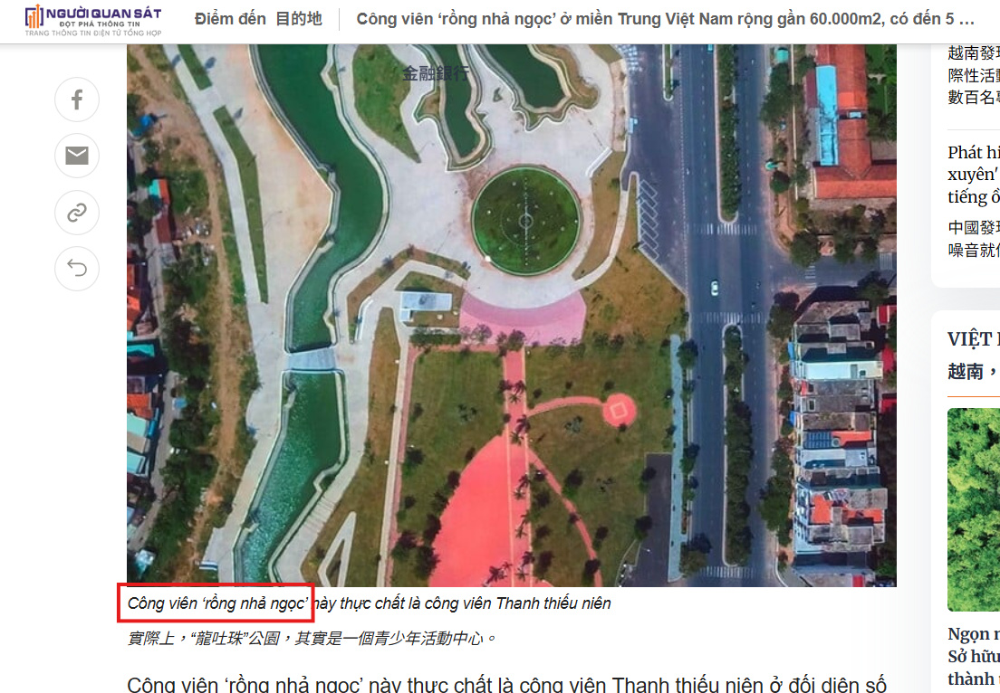
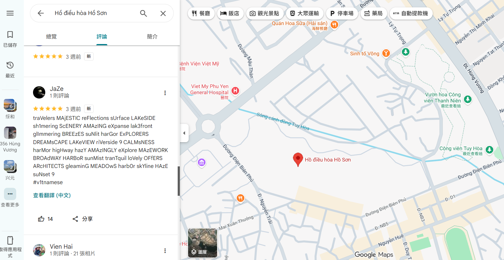

# 78CT

## 題目描述

Rawr and I used to spend hours at a lake right in the heart of our hometown during high school. It was our favorite spot to chill and just clear our minds when the afternoon breeze rolled in after those endless school days. There is also something interesting nearby. If you take a closer look from above, you might notice that a park next to the lake has a shape that resembles a dragon. Can you find the place and figure out what I left behind at the lake?

## 解題思路

先用 google 翻譯把 `越南 龍公園` 翻成 `Công viên Rồng Việt Nam`，然後去找，可以看到[這個網站](https://nguoiquansat.vn/cong-vien-rong-nha-ngoc-o-mien-trung-viet-nam-rong-gan-60-000m2-co-den-5-cay-cau-108935.html)



用 `Công viên ‘rồng nhả ngọc’` 在 google map 上面查即可找到圖片中的地點



接著點附近的景點，可以在 `` 看到一個很 sus 的留言



```text
traVelers MAjESTIC reFlections sUrface LAKeSIDE sh1mering ScENERY AMAzING eXpanse lak3front glImmering BREEzES suNlit harGor ExPLORERS DREAMsCAPE LAKeVIEW riVerside 9 CALMsNESS harMor higHway hazY AMAzINGLY eXplore MAzEWORK BROAdWAY HARBoR sunMist tranTquil loVely OFfERS ARcHITECTS gleaminG MEADOwS harb0r skYline HAzE suNset 9
#v1tnamese
```

把評論當中比較特別的字元抽出來，例如 `traVelers` 抽出 `V`，`MAjESTIC` 抽出 `j`，之後會得到一串 base64 encode 的字串 `VjFUe1czX3IzNGxseV9sMHYzXzdoMTVfcGw0YzN9`，把他 decode 以後就是 flag

## Flag

```text
V1T{W3_r34lly_l0v3_7h15_pl4c3}
```
