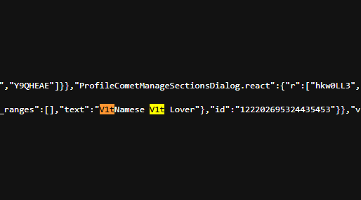
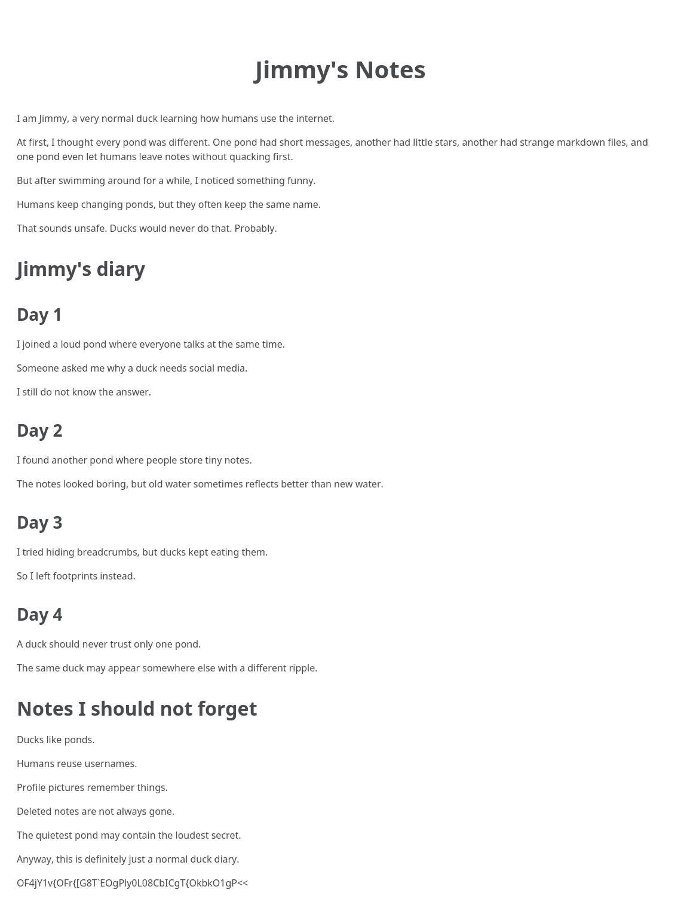

# Little Jimmy Writeup

## 題目描述

Jimmy @V1tJjimmy is a young V1te developer with an unusual obsession for ducks, clean interfaces, and tiny frontend experiments that probably started as jokes but somehow became real projects.

Between broken components, late-night commits, and suspiciously duck-themed side projects, he leaves behind just enough details for curious people to notice. Most of them look ordinary at first glance.

## 解題思路

這題我雖然沒有解出來第二部分的 flag，但因為是一題好題目所以還是寫了一個 writeup

1. **第一步**：

    在X上隨便搜一下就找到一個帳號：

    https://x.com/V1tJjimmy

    第一篇貼文很明顯就是題目說的duck project，再去github找一下就可以找到：

    https://github.com/jimmydev367/V1te-proDuck

    雖然看起來很乾淨，啥都沒有，但仔細檢查之後可以發現中間有commit被force push覆蓋了。

    ```bash
    ┌──(kali㉿kali)-[~/Desktop/ctf/V1T CTF/Little Jimmy]
    └─$ curl -sS \
    "https://api.github.com/users/jimmydev367/events/public?per_page=100" |
    jq '
    .[]
    | {
        type,
        created_at,
        repo: .repo.name,
        payload
        }
    '
    {
    "type": "WatchEvent",
    "created_at": "2026-06-26T14:50:51Z",
    "repo": "jimmydev367/V1te-proDuck",
    "payload": {
        "action": "started"
        }
    }
    {
    "type": "PushEvent",
    "created_at": "2026-06-26T14:40:58Z",
    "repo": "jimmydev367/V1te-proDuck",
    "payload": {
        "repository_id": 1265974080,
        "push_id": 36224030692,
        "ref": "refs/heads/main",
        "head": "e122e6e1dd024c3b8d5d22fe1c8ceeb11b1bf280",
        "before": "7727f21c1c8a30e1197b7c3b20eaa052833b90a1"
        }
    }
    {
    "type": "PushEvent",
    "created_at": "2026-06-26T14:40:34Z",
    "repo": "jimmydev367/V1te-proDuck",
    "payload": {
        "repository_id": 1265974080,
        "push_id": 36224011019,
        "ref": "refs/heads/main",
        "head": "7727f21c1c8a30e1197b7c3b20eaa052833b90a1",
        "before": "3324dfe058063f280ac73b50d936b07c1b85d730"
        }
    }
    {
    "type": "CreateEvent",
    "created_at": "2026-06-26T14:20:44Z",
    "repo": "jimmydev367/V1te-proDuck",
    "payload": {
        "ref": "main",
        "ref_type": "branch",
        "full_ref": "refs/heads/main",
        "master_branch": "main",
        "description": null,
        "pusher_type": "user"
        }
    }
    ```

    然後我們就可以在裡面找到被修改的內容：

    https://api.github.com/repos/jimmydev367/V1te-proDuck/events

    ```text
    {
        "profile_type": "accidental_internal_author_profile",
        "app": "V1te proDuck",
        "a_piece_of_flag": "VzB1ejExcXJeVzB1Ml5FdGJqXkBxcV5HMXNiMmVeVWkyXlRxcnVzMjVsXg==",
        "xor_key": "V1T{",
        "author": {
            "author_name": "Nguyen V1et Hoang"
            "display_name": "Quack Byte",
            "phone": "+1-202-555-0184",
            "email": "quackbyte.hoangnv@gmail.com",
            "facebook": "https://www.facebook.com/user0182883828282919"
        }
    }
    ```

    對上面的flag做xor就可以得到：

    ```text
    V1t{00ps_V1t3_Duck_App_F0rc3d_Th3_Upstr34m_
    ```

2. **第二步**：

    https://www.facebook.com/user0182883828282919

    進到這個facebook profile之後，就可以去網站原始碼那邊找到id：

    

    原理是facebook在更改個人簡介的時候會自動發一篇貼文，然後我們利用ctrl+F可以直接搜尋簡介，後面會連著他的簡介的貼文id，然後就可以直接到https://www.facebook.com/user0182883828282919/posts/122202695324435453 看到這篇貼文。

    底下有留言：

    

    

    第二張圖片的最下面有剩下的flag：

    ```text
    OF4jY1v{OFr{[G8T`EOgPly0L08CbICgT{OkbkO1gP<<
    ```

    後半段要先xor 0x01，然後會變成Base64，再轉成ascii就是：

    ```text
    NG5kX0wzNGszZF9UaDNfQmx1M19BcHBfUzNjcjN0fQ==
    4nd_L34k3d_Th3_Blu3_App_S3cr3t}
    ```

    Nice chall!

## Flag

```text
V1t{00ps_V1t3_Duck_App_F0rc3d_Th3_Upstr34m_4nd_L34k3d_Th3_Blu3_App_S3cr3t}
```
