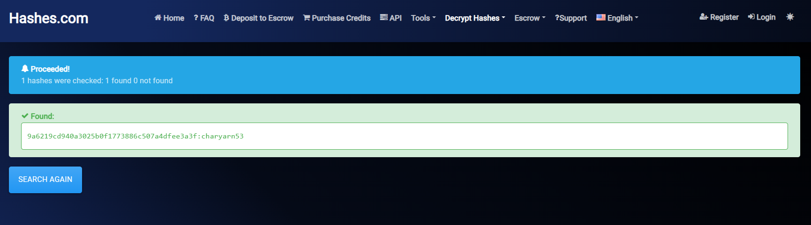

# Naive John

## 題目描述

John is just like many people online: one username, one password, and way too many places to reuse it.

He goes by the username:

`quackyjohn42067`

Some people scatter their accounts everywhere. Others collect everything into a single flashy bio page, usually with a Discord presence and enough “e-gangster” . He talk about guns lol energy to scare absolutely nobody.

John left a locked note somewhere in his little internet shrine. Find the note, figure out what password he probably reused, and recover the flag.

His password hash: `9a6219cd940a3025b0f1773886c507a4dfee3a3f`

## 解題思路

拿 `quackyjohn42067` 用各種 osint tool 都沒找到東西，之後發現題目有講到 `e-gangster` 和 `single flashy bio page` 以及 `guns lol`，常看 [NTTS](https://www.youtube.com/c/NoTextToSpeech) 應該都可以想到這個是 guns.lol 這個網站

去到 guns.lol/quackyjohn42067 可以看到[一個連結](https://anotepad.com/notes/bt5fnnjb)，輸入密碼以後就是 flag 了

密碼則是使用[這個網站](https://hashes.com/en/decrypt/hash)得到的 `charyarn53`



## Flag

```text
v1t{1113g41_051n7_15_7h3_n3w_m3t4_41ght}
```
