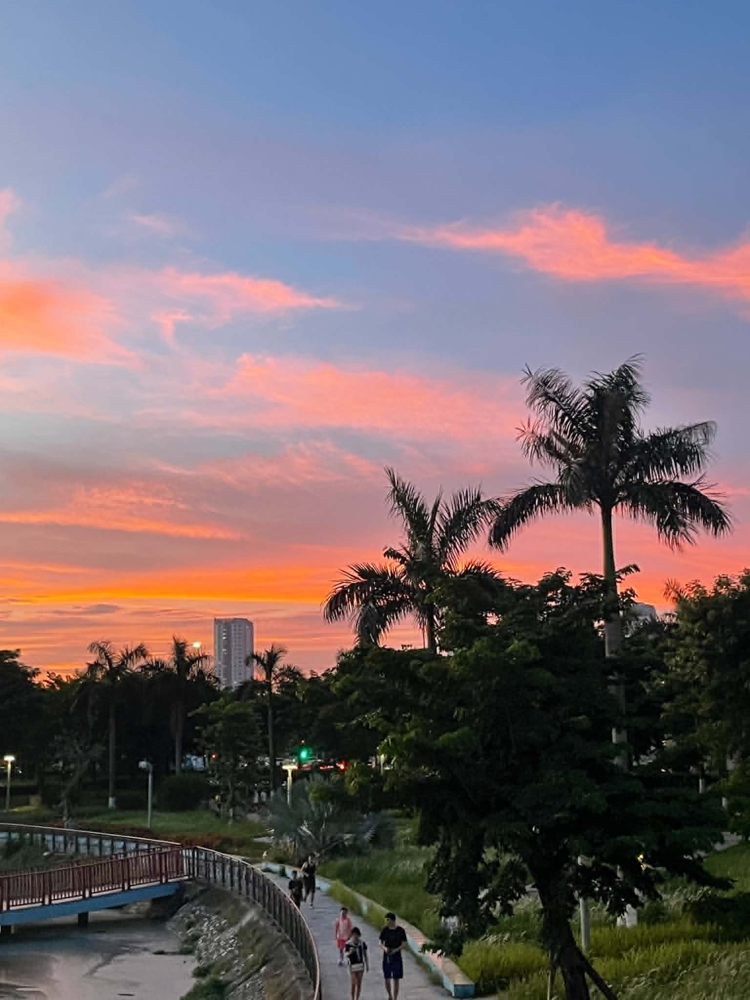
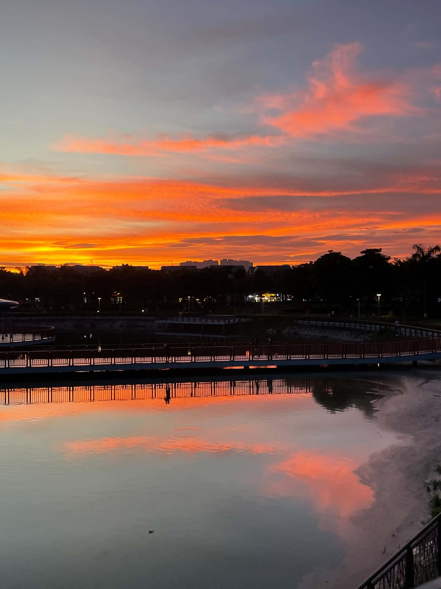
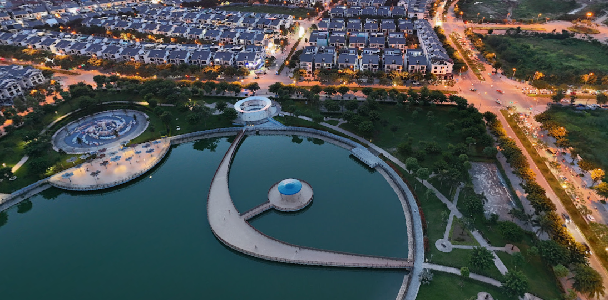

# Sun set Writeup

## Description

A quiet sunset, a calm lake, and a place where the sky feels a little closer than usual. It's a shame there weren't any ducks

Flag format: V1T{name_of_this_place} Ex: V1T{ho_linh_dam} or v1t{linh_dam_lake} both language work





## Solution Walkthrough

After a reverse image search, I found that it should be this beautiful park:



https://maps.app.goo.gl/wGu1YybrcqrsbBgn7

Then, I saw the name of the lake written on it, so I tried the lake's name, but none of them were correct.

I thought, how could it be the name of the park? But as it turned out, I tried it and it was correct. SMH.

## Flag

```text
V1T{astronomy_park}
```
