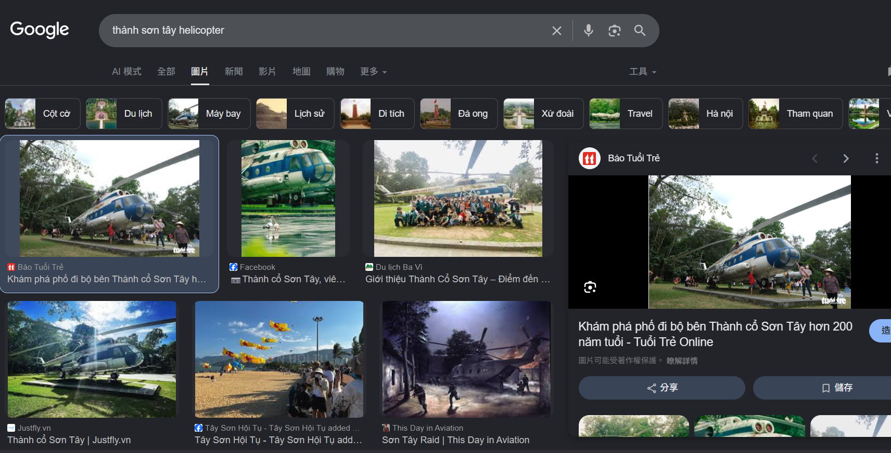

# Town Tour 01

## Description

Recently, I visited this place with my friends, and that was awesome. My friend from suburb of Hanoi told me that in his town there was a place that had similar structure like this one. I found that place, and they also have plane exhibition. Beside planes they have a helicopter. Do you know what model it is, and also the number of that helicopter? Flag format: V1T{Helicopter_model_number}. For eg: A Mikoyan-Gurevich MiG-21bis Fishbed L, number 36: V1T{Mikoyan_Gurevich_MiG_21bis_Fishbed_L_36}

## Solution Walkthrough

The location in the photo is the Hanoi Flag Tower, which is part of the Imperial Citadel of Thang Long. Since it is an ancient city, I searched Google for "Hanoi ancient city" and found that Google recommended the Son Tay Ancient Citadel.

Then, because the Chinese search results were limited, I switched to searching for `thành sơn tây helicopter` and found the model of the helicopter.



## Flag

```text
v1t{Mil_Mi_8_Hip_7822}
```
