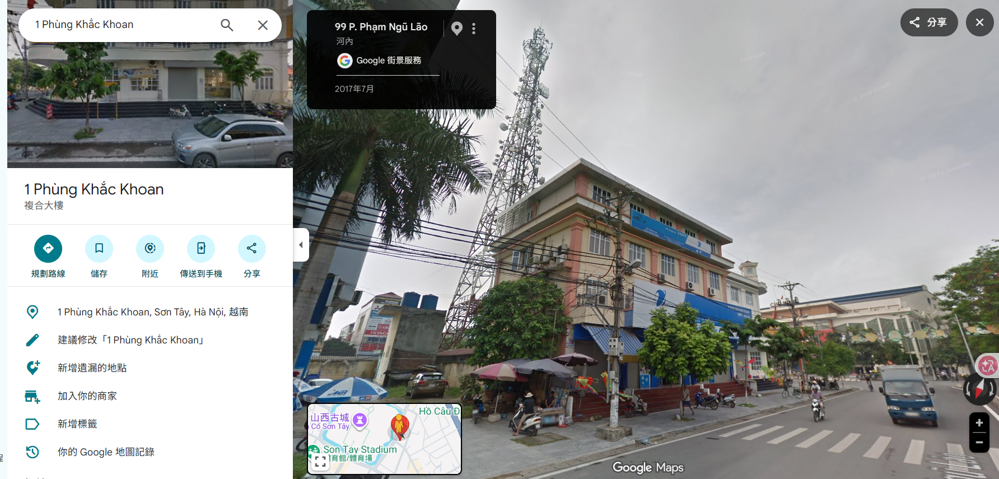
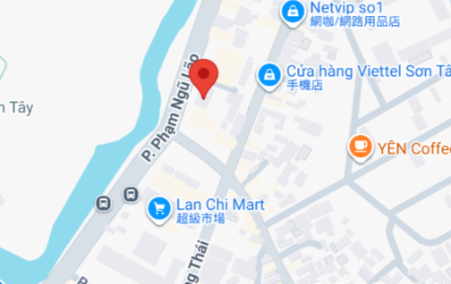

# Town Tour 02

## Description

On my way to buy my daily stuff at the nearby supermarket, I have to go pass this Vinaphone store. Do you know what is the supermarket I'm going to? (not the building name, it's the brand). P/s: U have to use lots of Google Translate for this :> And what u see on GG Maps might be different from the photo.

Example: v1t{Ha_Noi_Mart}

## Solution Walkthrough

You can find this location on Google Maps by performing a reverse image search.



You can see "lan chi mart" nearby.



## Flag

```text
v1t{Lan_Chi_Mart}
```
