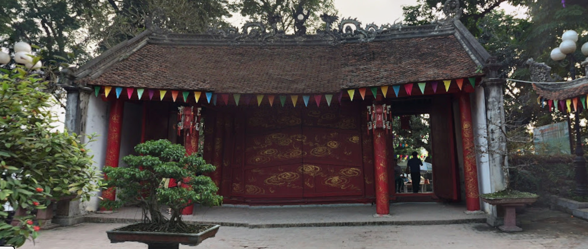

# Town Tour 3 Writeup

## 題目描述

What the three words?

Flag format: v1t{word1_word2_word3} (3 words in English)

https://what3words.com/



## 解題思路

以圖搜圖之後，發現是 https://maps.app.goo.gl/6wBLqSNFBZtWkS6k8，然後去what3word看一下就可以得到flag。

要多試幾次，因為google map的定位沒有很正確。

https://what3words.com/wheezes.toppling.transacted

## Flag

```text
v1t{wheezes_toppling_transacted}
```
