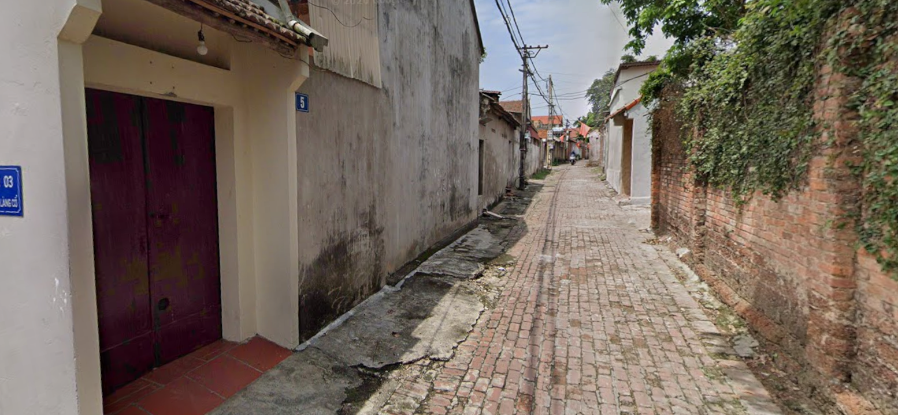
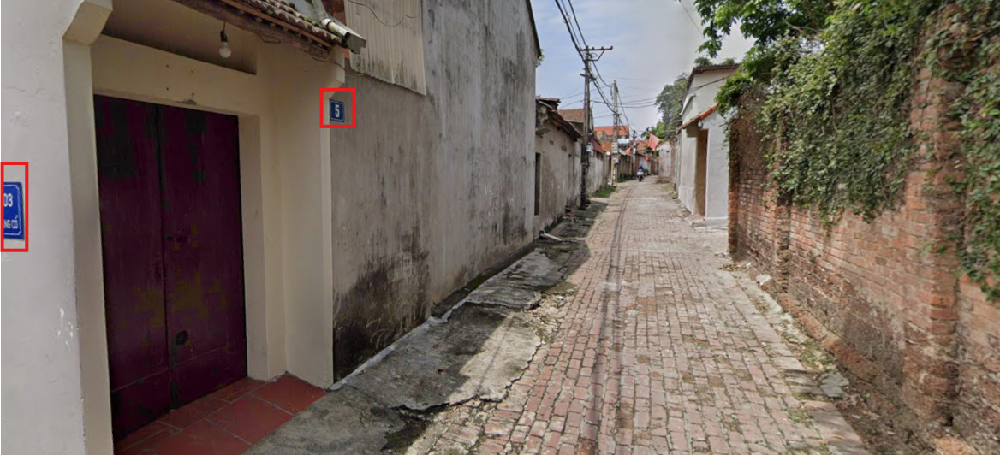
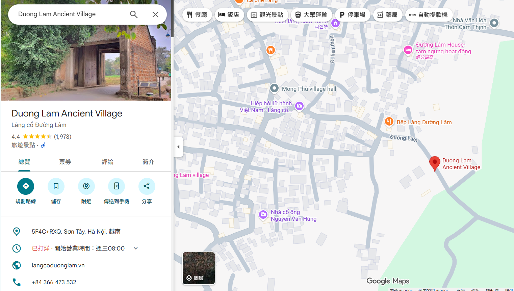
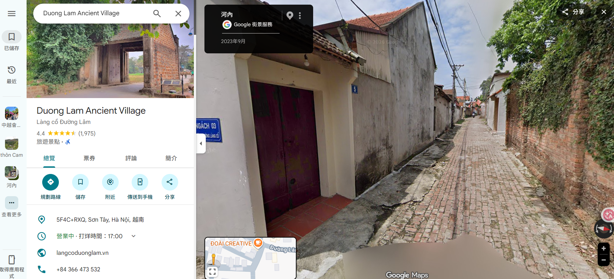
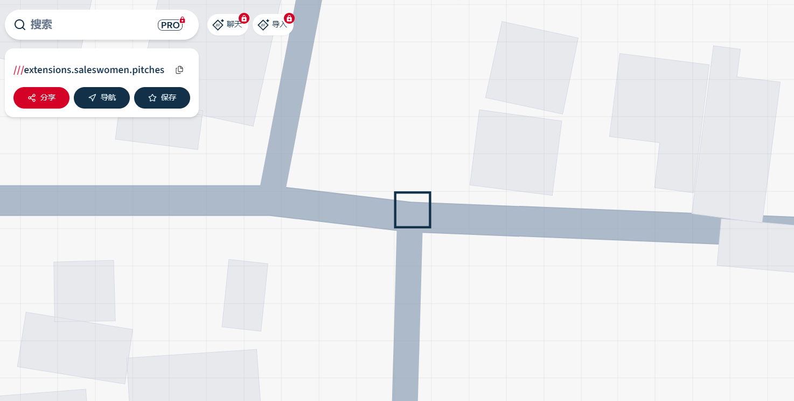

# Town Tour 4

## 題目描述

More, more three words!!!

Format: v1t{word1_word2_word3} (3 words in English)

https://what3words.com/



## 解題思路

圖片有 `lang co` 等門牌，於是就去 google map 找



因為出題者感覺都出河內得東西，所以我就找到這個地方



接著用街景就可以找到 flag 了





## Flag

```text
v1t{Lan_Chi_Mart}
```
