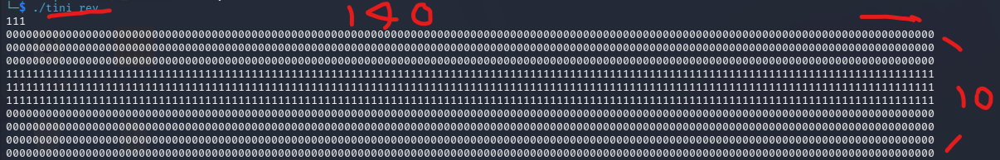
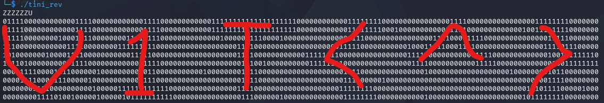

# Tiny

## Description

The tini duck makes the tini rev challenge with the tiniest flag

## Solution Walkthrough

After analyzing with IDA, we can see that the program works as follows: it first reads the user's input and then calculates the sum of their ASCII values (stored in `v3`), excluding newline characters (`\n`, `\r`).

```c
v0 = v71;
v1 = sys_read(0, buf, 0x100u);
v3 = 0;
if (v1 > 0)
{
    v4 = v2;
    v5 = v1;
    do
    {
        v6 = *v4++;
        if (v6 != 10 && v6 != 13)
            v3 = v6 + (unsigned int)v3;
        --v5;
    } while (v5);
}
```

Next, the program reads 227 words starting from `loc_4001B8`, subtracts the calculated sum `v3` from each word, and writes the result to another buffer.

```c
v7 = (__int16 *)&loc_4001B8;
v8 = &v73;
v9 = 227;
do
{
    v10 = *v7++;
    *(_WORD *)v8 = v10 - v3;
    v8 += 2;
    --v9;
} while (v9);
```

It is worth noting here that `loc_4001B8` is actually a block of encrypted data. IDA misidentified it as code, which is why the latter part of the decompilation shows a bunch of junk-looking `jb` / `jnz` / `add` instructions; these can be ignored.

The latter part of the program treats the decrypted characters as RLE (Run-Length Encoding) data, outputting a pattern consisting of 0s and 1s. `loc_40037E` stores the number of RLE segments for each row. There are 10 rows in total, with 140 characters per row.



For each row, it reads one character first, using its lowest bit to determine whether the starting character is '0' or '1'. After that, for every run length read, it fills in the corresponding number of characters while alternating between 0 and 1. A `\n` is appended after each row, and finally, it is output all at once using `sys_write`.

```c
v11 = v72;
v12 = (unsigned __int16 *)&v74;
v13 = (unsigned __int8 *)&loc_40037E;
for (i = 10; i; --i)
{
    v15 = *v13++;               // 這一列的 segment 數量
    v16 = v12 + 1;
    v17 = *v16;
    v12 = v16 + 1;
    v18 = (v17 & 1) + 48;       // 起始字元 '0' 或 '1'
    v19 = v71;
    v20 = 140;                  // 每列 140 個字
    for (j = v15 - 1; j; --j)
    {
        v22 = *v12++;           // run length
        if (v22 > v20)
            v22 = v20;
        v20 -= v22;
        while (v22)
        {
            *v19++ = v18;
            --v22;
        }
        v18 ^= 1u;              // 交替 0/1
    }
    qmemcpy(v11, v71, v19 - v71);
    v24 = &v11[v19 - v71];
    *v24 = 10;
    v11 = v24 + 1;
}
v25 = sys_write(1u, v72, v11 - v72);
v27 = sys_exit(0);
```

At this point, we can calculate the correct sum `s` directly. Since each row is fixed at 140 characters, the sum of the run lengths for the first row after decryption must be 140. Since the encryption simply adds `s` to each character, for `n` characters, the total sum increases by `n` * `s`.

```text
第一列加密字元的總和 = 140 + n * s

s = (第一列加密字元的總和 − 140) / n
```

Afterward, open the program and input any string with an ASCII sum of 625, such as `ZZZZZZU`, to obtain the flag.



## Flag

```text
v1t{^}
```
