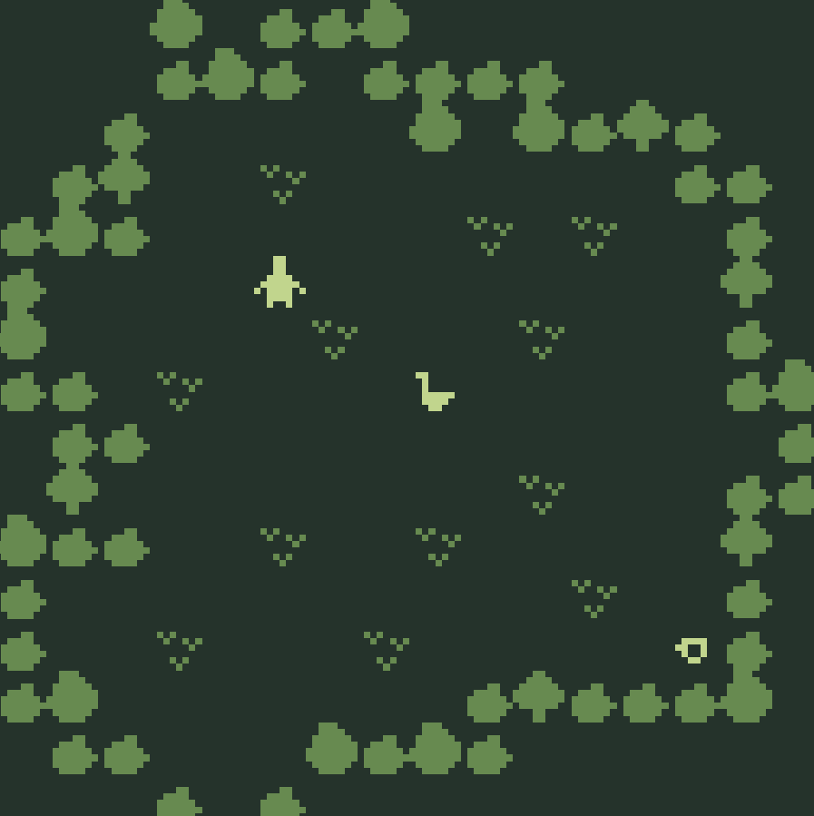
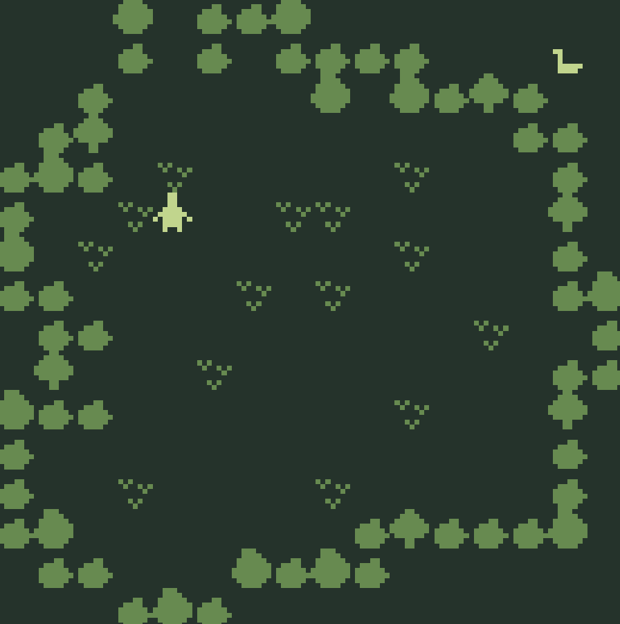
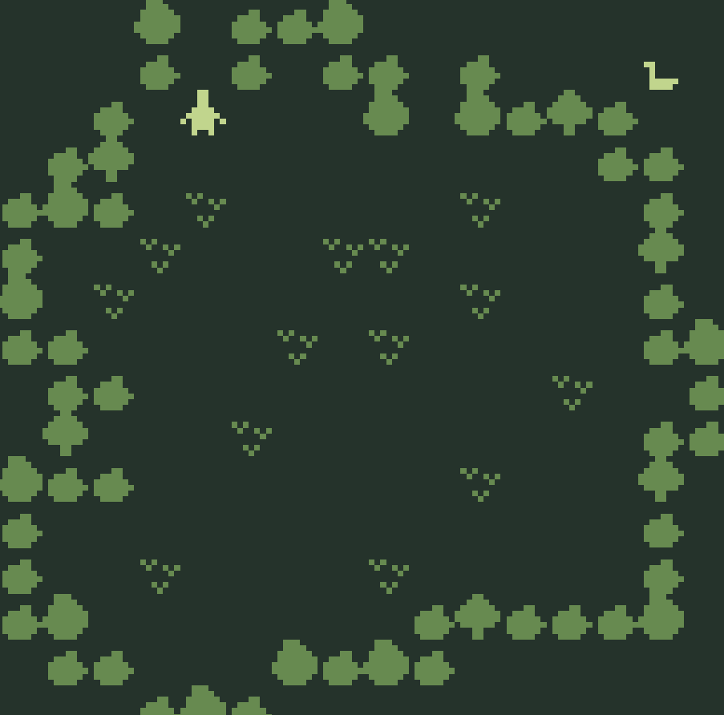

# B1tsy Ducky

## 題目描述

You need to enter your name then play to able to solve else it gonna error

https://b1tsy.v1t.site/

## 解題思路

這是一個小遊戲，基本上就是要找到鴨子要得東西以後再去找鴨子



可以發現在第三個房間應該就是特殊房間，因為我根本沒辦法到鴨子那裡



看 html 可以發現第三個房間長這樣

```text
ROOM 3
0,0,0,f,0,g,g,f,0,0,0,0,0,0,0,0
0,0,0,g,0,g,0,g,g,g,g,0,0,0,0,0
0,0,g,0,0,0,0,0,f,0,f,g,d,g,0,0
0,g,d,0,0,0,0,0,0,0,0,0,0,g,g,0
g,f,g,0,a,0,0,0,0,0,a,0,0,0,g,0
g,0,0,a,0,0,0,a,a,0,0,0,0,0,d,0
f,0,a,0,0,0,0,0,0,0,a,0,0,0,g,0
g,g,0,0,0,0,a,0,a,0,0,0,0,0,g,f
0,g,g,0,0,0,0,0,0,0,0,0,a,0,0,g
0,d,0,0,0,a,0,0,0,0,0,0,0,0,g,g
f,g,g,0,0,0,0,0,0,0,a,0,0,0,d,0
g,0,0,0,0,0,0,0,0,0,0,0,0,0,g,0
g,0,0,a,0,0,0,0,a,0,0,0,0,0,g,0
g,f,0,0,0,0,0,0,0,g,d,g,g,g,f,0
0,g,g,0,0,0,f,g,f,g,0,0,0,0,0,0
0,0,0,g,f,g,0,0,0,0,0,0,0,0,0,0
NAME example room copy 2
EXT 4,0 2 4,15
PAL 0
TUNE 2
```

可以推知 0 是代表可以自由移動的地方，所以把地圖改成底下這樣，就能碰到鴨子了

```text
ROOM 3
0,0,0,f,0,g,g,f,0,0,0,0,0,0,0,0
0,0,0,g,0,g,0,g,g,0,g,0,0,0,0,0
0,0,g,0,0,0,0,0,f,0,f,g,d,g,0,0
0,g,d,0,0,0,0,0,0,0,0,0,0,g,g,0
g,f,g,0,a,0,0,0,0,0,a,0,0,0,g,0
g,0,0,a,0,0,0,a,a,0,0,0,0,0,d,0
f,0,a,0,0,0,0,0,0,0,a,0,0,0,g,0
g,g,0,0,0,0,a,0,a,0,0,0,0,0,g,f
0,g,g,0,0,0,0,0,0,0,0,0,a,0,0,g
0,d,0,0,0,a,0,0,0,0,0,0,0,0,g,g
f,g,g,0,0,0,0,0,0,0,a,0,0,0,d,0
g,0,0,0,0,0,0,0,0,0,0,0,0,0,g,0
g,0,0,a,0,0,0,0,a,0,0,0,0,0,g,0
g,f,0,0,0,0,0,0,0,g,d,g,g,g,f,0
0,g,g,0,0,0,f,g,f,g,0,0,0,0,0,0
0,0,0,g,f,g,0,0,0,0,0,0,0,0,0,0
NAME example room copy 2
EXT 4,0 2 4,15
PAL 0
TUNE 2
```



然而碰到了還是得不到 flag，因為他會偵測 `referrer`，以及 `!isPlayerTalkingToSpecialDuck()`

```js
Object.defineProperty(window, "__bdx_17a", {
    configurable: true,
    enumerable: false,
    writable: false,
    value: function () {
        if (!isPlayerTalkingToSpecialDuck()) {
            alert("quack");
            return;
        }

        window.__duckWasmReady.then(function () {
            var room3Block = serializeRoomBlock("3");
            var referrer = document.referrer || "";
            var picked32 = pick32();

            if (!room3Block || !picked32) {
                alert("some thing go wrong go to start again");
                return;
            }

            if (typeof window.duckWasmReveal !== "function") {
                alert("some thing go wrong go to start again");
                return;
            }

            var flag_decrypt = window.duckWasmReveal(referrer, room3Block, picked32);
            if (flag_decrypt === "some thing go wrong go to start again") {
                alert(flag_decrypt);
                return;
            }

            window.flag = flag_decrypt;
            window.close();
        }).catch(function (err) {
            alert("WASM load failed: " + err);
        });
    }
});
```

把 `referrer` 變成 `https://b1tsy.v1t.site/`，以及移除 `!isPlayerTalkingToSpecialDuck()` 的判斷，~~即可得到 flag~~並沒有

```js
Object.defineProperty(window, "__bdx_17a", {
    configurable: true,
    enumerable: false,
    writable: false,
    value: function () {
        window.__duckWasmReady.then(function () {
            var room3Block = serializeRoomBlock("3");
            var referrer = "https://b1tsy.v1t.site/";
            var picked32 = pick32();

            if (!room3Block || !picked32) {
                alert("some thing go wrong go to start again");
                return;
            }

            if (typeof window.duckWasmReveal !== "function") {
                alert("some thing go wrong go to start again");
                return;
            }

            var flag_decrypt = window.duckWasmReveal(referrer, room3Block, picked32);
            if (flag_decrypt === "some thing go wrong go to start again") {
                alert(flag_decrypt);
                return;
            }

            window.flag = flag_decrypt;
            window.close();
        }).catch(function (err) {
            alert("WASM load failed: " + err);
        });
    }
});
```

仔細觀察一下原來是我們 `room3` 有改過東西導致解密失敗，用 console.log 看了一下 `serializeRoomBlock("3")` 的結果，原來是底下這樣

```text
ROOM 3
0,0,0,f,0,g,g,f,0,0,0,0,0,0,0,0
0,0,0,g,0,g,0,g,g,0,g,0,0,0,0,0
0,0,g,0,0,0,0,0,f,0,f,g,d,g,0,0
0,g,d,0,0,0,0,0,0,0,0,0,0,g,g,0
g,f,g,0,a,0,0,0,0,0,a,0,0,0,g,0
g,0,0,a,0,0,0,a,a,0,0,0,0,0,d,0
f,0,a,0,0,0,0,0,0,0,a,0,0,0,g,0
g,g,0,0,0,0,a,0,a,0,0,0,0,0,g,f
0,g,g,0,0,0,0,0,0,0,0,0,a,0,0,g
0,d,0,0,0,a,0,0,0,0,0,0,0,0,g,g
f,g,g,0,0,0,0,0,0,0,a,0,0,0,d,0
g,0,0,0,0,0,0,0,0,0,0,0,0,0,g,0
g,0,0,a,0,0,0,0,a,0,0,0,0,0,g,0
g,f,0,0,0,0,0,0,0,g,d,g,g,g,f,0
0,g,g,0,0,0,f,g,f,g,0,0,0,0,0,0
0,0,0,g,f,g,0,0,0,0,0,0,0,0,0,0
NAME example room copy 2
EXT 4,0 2 4,15
PAL 0
TUNE 2
```

所以把 `0,0,0,g,0,g,0,g,g,0,g,0,0,0,0,0` 換成 `0,0,0,g,0,g,0,g,g,g,g,0,0,0,0,0` ~~就好了~~還是拿不到 flag

之後問 ai 他說是因為程式原本期待解出來的 flag 長度是 28，結果真實 flag 長度只有 26，所以就會返回 something went wrong，解法就是自己寫一個 python 腳本

## Flag

```text
v1t{b1tsy_t1psy_duck_w4sm}
```
